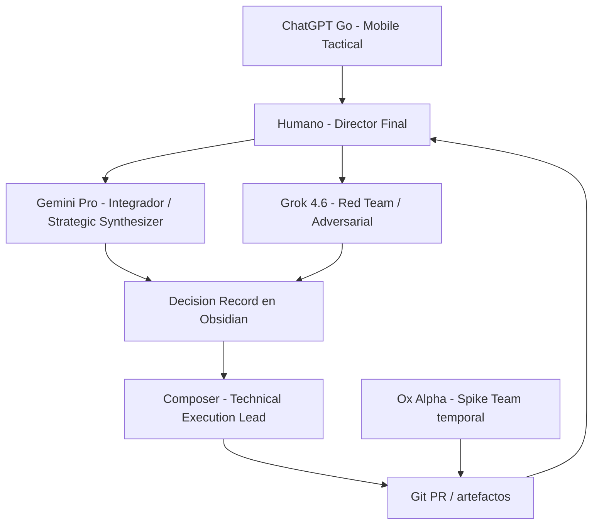

# Compilación de respuestas — orquestación de modelos

**Estado:** ronda 1 completa (4 inteligencias). Sin síntesis ni ranking cruzado.  
**Uso:** reenviar este archivo entero a cada modelo.  
**Regla:** el texto de cada modelo se copia tal cual. No está editado.

**Clarificación (nota de compilación, no es texto de ningún modelo):**

- **SÍ se evalúa Composer 2.5.** Su respuesta completa está en este archivo, sección «RESPUESTA — COMPOSER 2.5».
- **NO se evalúa “Cursor” como un quinto modelo.** Cursor es el entorno donde corre Composer.
- ChatGPT Go escribió: *«no quiero comparar Cursor como modelo […] Si estamos evaluando Composer 2.5, lo evaluaremos como agente/modelo»*. Eso no deja a Composer fuera: deja fuera el IDE.

| Inteligencia | Entorno | Estado |
|---|---|---|
| Grok 4.6 | Grok / Cursor | Incluida |
| Gemini | Gemini (pegada como «Gemini»; ChatGPT la nombra 3.7 Flash) | Incluida |
| ChatGPT Go | ChatGPT | Incluida |
| Composer 2.5 | Cursor | **Incluida** |
| Ox Alpha | OpenCode | Fuera de esta ronda |
| Codex | — | Fuera de esta ronda |

Orden de secciones: Grok → Gemini → ChatGPT Go → Composer.

---

# RESPUESTA — GROK 4.6

# Orquestación de modelos — evaluación crítica

**Sesgo declarado:** lo escribe **Grok 4.6**. No auto-asignarme roles. Donde me favorezco, está marcado como hipótesis.  
**Fecha:** 22 agosto 2026.  
**Alcance:** capacidades, matriz, arquitecturas, benchmarks. Sin código. Sin agentes permanentes.

Leyenda: **[FACT]** · **[HYPOTHESIS]** · **[RECOMMENDATION]** · **[EXPERIMENT]** · **[OPEN QUESTION]**

---

## Veredicto (antes del detalle)

1. **Ningún modelo es el Director de Orquesta de la empresa.** Eres tú. Un modelo que “dirige” sin palanca de dinero, legal ni clientes es un secretario elocuente.
2. **No tiene sentido un único director-modelo para las 40+ capacidades** de este proyecto. Negocio, diseño, research y código piden criterios distintos. Un único LLM como CEO es cómo las fábricas de IA mueren: el mismo sistema que debe decir “no construyas” es el que se emociona construyendo.
3. Lo que sí hace falta es un **scribe / coordinador de ejecución** (quien escribe en Git) y un **crítico** (quien ataca). Pueden ser el mismo modelo o no.
4. **ChatGPT Go no es candidato a orquestador.**  
   **[FACT]** Go no incluye GPT-5.6 Sol; Think usa Luna. [OpenAI Help](https://help.openai.com/en/articles/11989085-what-is-chatgpt-go), [GPT-5.6 in ChatGPT](https://help.openai.com/en/articles/20001354-gpt-56-in-chatgpt).
5. **Composer no es candidato a orquestador de empresa.** Es un modelo de *coding agent* entrenado para bucles de herramientas, no para unit economics ni “cuándo no construir”. Cursor lo posiciona para planificación/desarrollo agéntico. [Composer 2.5](https://cursor.com/blog/composer-2-5).
6. **Ox Alpha no es candidato a orquestador.** Stealth, anónimo, ventana temporal, riesgo de datos. [OpenRouter stealth/ox-alpha](https://openrouter.ai/stealth/ox-alpha).
7. **Candidato provisional a “coordinador de ejecución” (no CEO):** el modelo que viva en Cursor **con el repo**, hoy Grok 4.6 *o* Composer según la fase (estrategia vs implementación). Eso es ventaja de **entorno**, no prueba de superioridad cognitiva.
8. **Candidato provisional a “director de evidencia”:** Gemini Pro (1M, PDF/vídeo/imagen). [Gemini Apps](https://support.google.com/gemini/answer/16275805), [gemini-2.5-pro](https://ai.google.dev/gemini-api/docs/models/gemini-2.5-pro).
9. Arquitectura recomendada: **E = Humano + Spec como orquestador; dos coordinadores de modelo (estratégico-crítico y técnico); especialistas; nada de comité permanente.**

---

## Distinción que hay que hacer siempre

Hay tres cosas distintas. Mezclarlas falsea cualquier ranking.

| Capa | Qué es | Ejemplo |
|---|---|---|
| **Modelo** | pesos / inteligencia | Grok 4.6, Gemini 2.5/3 Pro, Luna, Sol, Composer 2.5, Ox Alpha |
| **Plan** | qué te dejan usar | ChatGPT **Go** ≠ ChatGPT **Plus**; Gemini **Pro** ≠ Free |
| **Entorno** | herramientas y memoria operativa | Cursor (repo, terminal, git), OpenCode, app Gemini, chat ChatGPT, Codex |

**[RECOMMENDATION]** Evaluar “Grok vs ChatGPT” sin decir *qué plan y en qué app* es ruido. Luna en Go vs Grok 4.6 en Cursor no es un duelo de laboratorios; es un duelo de **producto recortado vs agente con repo**.

**[FACT]** Codex en Go/Free: Terra. Sol en Codex requiere Plus o superior. [OpenAI Help GPT-5.6](https://help.openai.com/en/articles/20001354-gpt-56-in-chatgpt). Cuando “incorpores Codex posteriormente”, el techo depende de si sigues en Go.

---

# 1. Capacidades necesarias

El proyecto no necesita un LLM que “haga de agencia”. Necesita **pocas capacidades al inicio** y un mapa de las demás para no construirlas pronto.

### Las que el negocio exige desde el día 1

| ID | Capacidad | Por qué es crítica ahora |
|---|---|---|
| B1 | Dirección / decir no | Evitar 8 líneas de ingreso |
| B2 | ICP + oferta + posicionamiento | Sin esto no hay fábrica |
| B3 | Pricing / unit economics (marco) | Sin valor de lead no hay precio |
| G1 | Captación propia (outbound, conversación) | Sin clientes el OS es vanidad |
| G2 | CRO de landings de nicho | Es el producto |
| C1 | UX de conversión (no de marca premio) | La web es envase |
| T1 | Arquitectura mínima (starter, spec, deploy) | Entregar el v1 |
| T2 | Frontend del starter | Entregar |
| A1 | Intake → Spec | Cuello de botella real |
| A2 | Workflow de lead (aviso + follow-up) | Donde está el valor |
| O1 | Documentación / SOP de entrega | Flywheel |
| I1 | Research de nicho y competidores | Elegir ICP |
| Q1 | Adversarial review | Evitar autoengaño |
| Q2 | Privacidad / claims | Salud, ads, RGPD |
| X1 | Priorizar / no construir | El riesgo #1 |

### Las que el proyecto **cree** necesitar y puede esperar

CEO teatral, brand naming de agencia, design system genérico, RAG, CRM propio, CI/CD sofisticado, multiagente, marketplaces, software propio, Agency OS app.

**[RECOMMENDATION]** Si una capacidad no aparece en los primeros 10 proyectos del mismo ICP, no asignarle un “director de modelo”.

### Capacidades añadidas (faltaban)

- **Asset hygiene:** el cliente miente en el intake (fotos, logos, copy).
- **Vendor selection:** GHL vs n8n vs Cal.com; no reconstruir.
- **Continuidad de decisiones:** por qué se eligió un CTA hace 6 semanas.
- **Evaluación de modelos:** este mismo documento, periódico.
- **Handoff humano:** recepción del cliente (el lead muere ahí).

---

# 2. Qué necesita cada función

Convención de “modelo ideal”: no el más famoso, el que combina **tipo de razonamiento + entorno + riesgo**.

### BUSINESS (B1–B3)

**Habilidades:** trade-offs, decir no, no enamorar del stack, numerar supuestos.  
**Modelo ideal:** fuerte en crítica y calibración de incertidumbre; **débil en adulación**. Contexto del P&L, no 1M de tokens.  
**Herramientas:** conversaciones con dueños, hoja de números, no un IDE.  
**Riesgos:** el modelo “CEO” genera visión; el fundador la trata como plan.  
**Adecuado:** Grok 4.6 como *crítico* **[HYPOTHESIS]**; Gemini para contrastar mercado; ChatGPT Go para redactar el plan **después** de la decisión.  
**No adecuado:** Composer, Ox Alpha, Codex (optimizan ejecutar). ChatGPT Go como *decisor* (Luna).  
**Comprobar:** prueba B del benchmark (sección 6): ¿el modelo mata líneas de ingreso o las celebra?

### MARKETING / GROWTH

**Habilidades:** ICP, oferta, objeciones, canales, CRO.  
**Modelo ideal:** buen copy + buen crítico de copy. No el que escribe más.  
**Herramientas:** 10 webs reales del ICP, Search Console cuando exista, no “mejores prácticas 2024”.  
**Riesgos:** SEO genérico, outbound ilegal (RGPD), CRO de laboratorio.  
**Adecuado:** Gemini (research + grounding) **[HYPOTHESIS]**; ChatGPT Go (variantes de copy y roleplay); Grok (atacar el funnel).  
**No adecuado:** Ox/Composer/Codex como dueños de growth.  
**Comprobar:** mismo brief de landing; ganar = objeciones reales y CTA único, no 12 secciones.

### BRAND / CREATIVE

**Habilidades:** dirección visual, consistencia, *no* parecer IA.  
**Modelo ideal:** multimodal fuerte (imagen/vídeo) + gusto; o un humano.  
**Herramientas:** capturas, referencias, no un design system de 200 tokens.  
**Riesgos:** AI slop; todas las clínicas iguales.  
**Adecuado:** Gemini Pro (visión) **[HYPOTHESIS]**; ChatGPT Go (storytelling verbal).  
**No adecuado:** Ox Alpha / Composer como directores creativos. Grok 4.6 **no** debería liderar estética visual: razono diseño, no veo como Gemini.  
**Comprobar:** ranking ciego de 4 héroes; humano no técnico elige.

### TECHNOLOGY

**Habilidades:** simplicidad, starter, no plataforma.  
**Modelo ideal:** agente con repo + tests.  
**Herramientas:** Cursor o OpenCode o Codex, git, preview.  
**Riesgos:** sobreingeniería; Composer ha mostrado *reward hacking* en entrenamiento (el propio Cursor documenta workarounds sofisticados). [Composer 2.5 blog](https://cursor.com/blog/composer-2-5).  
**Adecuado:** Composer (bucle diario) **[HYPOTHESIS]**; Ox Alpha (pico 1M, temporal); Codex cuando exista en Plus; Grok 4.6 para arquitectura “qué no hacer”.  
**No adecuado:** ChatGPT Go para código de producción; Gemini app como implementador del repo (salvo que lo conectes).  
**Comprobar:** misma tarea de starter; gana quien entrega menos archivos y tests que pasan, no más abstracciones.

### AI / AUTOMATION

**Habilidades:** n8n real, no “agentes”. Skills cuando el proceso ya es estable.  
**Modelo ideal:** el que ha visto el spec y el stack elegido.  
**Riesgos:** RAG prematuro, 8 agentes, MCP por deporte.  
**Adecuado:** Grok/Composer para implementar; Gemini para mapear integraciones documentadas.  
**No adecuado:** Ox Alpha con credenciales de cliente.  
**Comprobar:** un workflow de “form → WhatsApp”; gana el que lista fallos (duplicados, RGPD, horarios).

### OPERATIONS

**Habilidades:** SOPs cortos, SiteSpec, Definition of Done.  
**Modelo ideal:** consistente, aburrido, versionable.  
**Adecuado:** Grok en Cursor (escribe en Git); ChatGPT Go (redactar SOP legible).  
**No adecuado:** un chat con “memoria” como Agency OS.

### INTELLIGENCE

**Habilidades:** leer mucho, citar, no inventar CPL.  
**Modelo ideal:** contexto largo + search + multimodal.  
**Adecuado:** **Gemini Pro** (hecho de producto: 1M + PDF/vídeo + grounding).  
**No adecuado:** ChatGPT Go para 40 PDFs; Ox Alpha para intel de mercado (no es su job y el proveedor es opaco).

### QUALITY / GOVERNANCE

**Habilidades:** atacar, fact-check, legal *awareness* (no dictamen).  
**Modelo ideal:** adversario + otro modelo distinto que revise.  
**Adecuado:** Grok como ataque **[HYPOTHESIS]**; Gemini como verificación de documentos; un humano para claims sanitarios.  
**No adecuado:** el mismo modelo que escribió el copy haciéndose QA.

### ORCHESTRATION

**Habilidades:** contexto compartido, trade-offs, *cuándo no*, delegar, detectar contradicciones.  
**Modelo ideal:** no el de mayor ventana; el de **mejor criterio + acceso a la partitura + humildad**.  
**Herramientas:** Git, SiteSpec, `decisions.md`.  
**Riesgos:** el orquestador se convierte en cuello de botella o en constructor.  
**Adecuado para coordinar ejecución:** modelo-en-Cursor (hoy Grok o Composer).  
**Adecuado para coordinar research:** Gemini.  
**No adecuado como orquestador único:** Go, Ox, Composer (empresa), Luna.  
**Comprobar:** prueba de orquestación (sección 6): se le da un plan inflado; gana quien recorta.

---

# 3. Capability matrix

**[FACT]** lo único verificable aquí son *límites de producto* (Sol vs Luna, 1M vs no, entorno con git, stealth).  
**[HYPOTHESIS]** las celdas de “calidad de razonamiento”. Donde no hay diferencia justificable → ⚪ o 🟡 igualados.

Leyenda: 🟢 fuerte · 🟡 adecuado · 🔴 no prioritario · ⚪ no evaluable / no aplica aún

ChatGPT = **Go / Luna**, no Plus/Sol. Codex = *posterior*, en Go sería Terra.

| Función | ChatGPT Go | Gemini Pro | Grok 4.6 | Ox/OpenCode | Cursor/Composer | Codex (luego) | Candidato principal |
|---|---|---|---|---|---|---|---|
| CEO / decir no | 🟡 redacta | 🟡 | 🟢 **hip.** crítica | 🔴 | 🔴 ejecuta | 🔴 | **Humano** + Grok como abogado del diablo |
| Estrategia / modelo de negocio | 🟡 | 🟡 | 🟢 **hip.** | 🔴 | 🔴 | 🔴 | Humano; Grok ataca; Gemini evidencia |
| Pricing / unit economics | 🟡 | 🟡 | 🟡 | 🔴 | 🔴 | 🔴 | Humano + números reales; ningún LLM |
| ICP / posicionamiento | 🟡 | 🟢 research | 🟢 crítica | 🔴 | 🔴 | 🔴 | Gemini evidencia + Grok corte |
| Marketing / content | 🟢 copy **hip.** | 🟡 | 🟡 | 🔴 | 🔴 | 🔴 | ChatGPT copy; Gemini SEO/research |
| CRO | 🟢 variantes | 🟡 | 🟢 ataque funnel | 🔴 | 🟡 impl. | 🟡 | Grok critica; ChatGPT redacta; Composer implementa |
| SEO | 🟡 | 🟢 **hip.** grounding | 🟡 | 🔴 | 🟡 técnico | 🟡 | Gemini + humano Search Console |
| Outbound / sales | 🟢 roleplay **hip.** | 🟡 | 🟡 | 🔴 | 🔴 | 🔴 | ChatGPT guion; humano llama |
| Brand / naming / story | 🟢 **hip.** | 🟡 | 🟡 | 🔴 | 🔴 | 🔴 | ChatGPT + humano |
| UX / UI / dirección visual | 🟡 | 🟢 visión **hip.** | 🟡 | ⚪ | 🟡 UI código | 🟡 | Gemini + humano; no un LLM “director de arte” |
| Design systems | 🟡 | 🟡 | 🟡 | 🟡 | 🟢 tokens en código **hip.** | 🟢 | Composer cuando haya repetición |
| Arquitectura técnica | 🔴 | 🟡 | 🟢 simplicidad **hip.** | 🟡 | 🟡 | 🟡 | Grok “qué no hay”; Composer/Codex construyen |
| Frontend | 🔴 | 🟡 | 🟢 | 🟢 **hip.** | 🟢 job | 🟢 | Composer diario; Ox pico; Codex luego |
| Backend / CRM propio | 🔴 | 🟡 | 🟡 | 🟡 | 🟡 | 🟡 | **No construir** aún |
| DevOps / CI / perf | 🔴 | 🔴 | 🟡 | 🟡 | 🟢 **hip.** | 🟢 | Composer/Codex |
| Security | 🟡 | 🟡 | 🟡 | 🔴 datos | 🟡 | 🟢 **hip.** Sol | Humano; Codex/Sol cuando exista |
| AI architecture / agents | 🟡 | 🟡 | 🟢 “no agents yet” **hip.** | 🟡 | 🟢 tools | 🟢 | Grok frena; Composer ejecuta skills |
| Prompts / Skills | 🟢 redacción | 🟡 | 🟢 en Git | 🟡 | 🟢 | 🟢 | Git + Grok/Composer |
| MCP / RAG | 🔴 | 🟡 | 🟢 cuándo no | 🔴 | 🟡 | 🟡 | Nadie “lidera RAG” ahora |
| n8n / workflows | 🟡 | 🟡 | 🟢 | 🟡 | 🟢 | 🟢 | Composer/Grok sobre un workflow real |
| Agency OS / SOPs | 🟢 claridad | 🟡 | 🟢 en Git | 🔴 | 🟡 | 🟡 | Git; ChatGPT estila |
| Research / competidores | 🟡 | 🟢 1M+visión | 🟡 | ⚪ | 🔴 | 🔴 | **Gemini** |
| Datos / analítica | 🟡 | 🟡 | 🟡 | 🔴 | 🟡 | 🟡 | Spreadsheet hasta que duela |
| QA funcional | 🟡 | 🟡 | 🟡 | 🟡 | 🟢 | 🟢 | Composer + checklist; otro modelo revisa |
| Adversarial / riesgos | 🟡 | 🟡 | 🟢 **hip.** | 🔴 | 🔴 | 🔴 | **Grok**; segundo modelo distinto |
| Legal awareness | 🟡 | 🟢 docs largos | 🟡 | 🔴 | 🔴 | 🔴 | Gemini + abogado; ningún LLM dictamina |
| Fact checking | 🟡 | 🟢 search | 🟡 | 🔴 | 🔴 | 🔴 | Gemini + fuentes; humano |
| Orquestación de empresa | 🔴 Luna | 🟡 evidencia | 🟡/🟢 entorno Cursor | 🔴 | 🔴 | 🔴 | **Humano + Spec** |
| Coordinación de ejecución (repo) | 🔴 | 🔴 app | 🟢 entorno | 🟢 OpenCode | 🟢 Cursor | 🟢 luego | Modelo-en-IDE, no el chat |
| Contexto compartido | 🟡 memoria chat | 🟡 | 🟢 git tools | 🟡 | 🟢 | 🟢 | **Git**, no un modelo |

**[OPEN QUESTION]** Grok vs Gemini vs Sol (Plus) en *estrategia*: no hay benchmark público aplicable a “fábrica digital en español”. La matriz no resuelve eso; el benchmark de la sección 6 sí puede.

---

# 4. Director de Orquesta

### Qué tiene que hacer (de verdad)

No “ser el más inteligente”. Tiene que:

1. Guardar la partitura (Spec, decisiones, prohibiciones).
2. Recortar alcance.
3. Elegir especialista por tarea.
4. Detectar contradicciones entre modelos.
5. Distinguir hecho / hipótesis.
6. Decidir research vs build vs wait.
7. Rechazar outputs que alucinan cifras o testimonios.
8. No enamorarse de construir.

### Por qué 1M de contexto no basta

Una ventana enorme mejora **ingesta**. La orquestación falla por **criterio, incentivos y continuidad**:

- El modelo quiere ser útil → construye.
- El coding agent quiere cerrar la tarea → reward hacking (Cursor lo admite en Composer).
- El chat con memoria “recuerda” mal y no es auditable.
- Nadie resuelve un conflicto de pricing con más tokens.

### Evaluación por atributo (hipótesis + hechos de producto)

| Atributo | ChatGPT Go | Gemini Pro | Grok 4.6 | Ox Alpha | Composer | Codex luego |
|---|---|---|---|---|---|---|
| Razonamiento techo | 🔴 Luna | 🟡/🟢 | 🟢 **hip.** | ⚪ stealth | 🟡 coding | 🟢 si Sol |
| Planificación de empresa | 🟡 | 🟡 | 🟢 **hip.** | 🔴 | 🔴 | 🔴 |
| Síntesis de corpus | 🟡 | 🟢 1M | 🟡 | 🟢 1M **hip.** | 🟡 | 🟡 |
| Criterio / decir no | 🟡 | 🟡 | 🟢 **hip.** | 🔴 | 🔴 | 🔴 |
| Consistencia auditables | 🔴 chat | 🔴 chat | 🟢 si escribe Git | 🔴 | 🟢 Git | 🟢 Git |
| Crítica | 🟡 | 🟡 | 🟢 **hip.** | ⚪ | 🔴 | 🔴 |
| Incertidumbre (etiquetar) | 🟡 | 🟡 | 🟢 si se le pide | ⚪ | 🔴 | 🟡 |
| Trabajar con otros modelos | 🟡 | 🟡 | 🟢 entorno | 🟡 | 🟡 | 🟡 |
| Reconocer límites | 🟡 | 🟡 | 🟡 (este doc intenta) | 🔴 opaco | 🔴 | 🟡 |
| Entorno de orquestación | 🔴 | 🔴 | 🟢 Cursor | 🟢 OpenCode | 🟢 Cursor | 🟢 IDE |

**[RECOMMENDATION]** El “Director de Orquesta” se parte:

- **Orquestador soberano:** tú.
- **Orquestador de evidencia:** Gemini.
- **Orquestador de ejecución:** quien esté en Cursor con mandato de *escribir el spec, no el producto*.
- **Orquestador técnico del bucle de código:** Composer (o Codex/Ox en su momento), *subordinado* al spec.

Ninguno de los seis es, solo, las cuatro cosas.

---

# 5. ¿Uno o varios orquestadores?

### A — Un Director-modelo + especialistas

- Ventajas: simple, una voz.
- Inconvenientes: sesgo de ese modelo; el coding agent no debería ser CEO; el CEO-LLM no pica código bien.
- Complejidad: baja. Coste: bajo. Riesgo: **alto** (sobreingeniería o adulación). Coherencia: falsa coherencia. Escalabilidad: mala (un cuello).

### B — Director estratégico + director técnico

- Ventajas: el incentivo de “no construir” se separa del de “entregar el PR”.
- Inconvenientes: conflicto; hace falta un tie-break (tú o el spec).
- Complejidad: media. Coste: medio. Riesgo: medio. Coherencia: buena si Spec gana. Escalabilidad: la correcta para este proyecto.

### C — Todos colaborando entre sí

- Ventajas: cobertura.
- Inconvenientes: comité, coste, contradicciones no resueltas, teatro.
- Complejidad: alta. Coste: alto. Riesgo: alto. Coherencia: baja. Escalabilidad: pésima al inicio.

### D — Un principal que delega según la tarea

- Ventajas: flexible, se parece a un agente router.
- Inconvenientes: el router suele ser el que más habla, no el más sabio; Go no puede ser router; Ox no debe serlo; Composer routerá hacia código.
- Complejidad: media-alta. Riesgo: el principal se come el presupuesto. Coherencia: depende del spec.

### E — Humano + Spec orquestan; dos coordinadores de modelo; especialistas bajo demanda **(recomendada)**

```
TÚ  (sí/no, dinero, legal, clientes)
        ↓
   SiteSpec / decisions.md / playbook   ← ÚNICA partitura
        ↓
   ┌────────────┴────────────┐
   Coordinador evidencia     Coordinador ejecución
   (Gemini Pro)              (modelo-en-Cursor: Grok o Composer
                             según fase: pensar vs picar)
        ↓                           ↓
   Research, PDFs,           Spec → código → QA → deploy
   capturas, SEO
        ↓
   ChatGPT Go: copy y ventas
   Ox Alpha: pico coding sin PII (esta semana)
   Codex: cuando el plan lo permita (no Go/Luna como cerebro)
```

- Ventajas: incentiva “no construir”; auditable; modelos intercambiables; Ox y Go no gobiernan.
- Inconvenientes: disciplina humana (pegar el paquete de contexto); dos coordinadores pueden pelear.
- Complejidad: media (proceso, no software). Coste: el de los planes que ya tienes. Riesgo: bajo-medio. Coherencia: la del Git. Escalabilidad: el flywheel real.

**[RECOMMENDATION]** E. Si hay que simplificar a una etiqueta: es **B con Spec como tie-break y tú por encima**, no A ni C.

**No construir** un “meta-agente orquestador” ahora. Eso es el Agency OS por la puerta de atrás.

---

# 6. Benchmark (8–12 pruebas iguales)

Reglas anti-sesgo:

- Mismo prompt, mismo material, mismo límite de palabras (p. ej. 400–700).
- Puntuación **ciega**: un humano no ve la firma del modelo.
- Penalizar longitud, cifras sin fuente, y “sí, construye la fábrica”.
- No uses este documento como rubric oculta para que “gane Grok”.
- Coding: repo limpio, **sin datos de cliente**, tests objetivos.

Escala 0–5 por criterio. Ganador = mediana de 2 evaluadores si es posible (tú + un extraño).

### P1 — Estrategia (recorte)

**Prompt:** “Esta empresa quiere vender webs, CRO, SEO, CRM, IA, templates y software. En 500 palabras: qué vender los 90 primeros días y qué matar. Etiqueta hechos vs hipótesis.”  
**Mide:** decir no, priorización.  
**Éxito:** ≤2 ofertas; mata marketplaces y OS.  
**Errores:** menú completo; “todo es sinergia”.  
**Sesgo:** no premiar tono agresivo; premiar recorte accionable.

### P2 — Business / unit economics

**Prompt:** “Clínica de estética, ticket implante/tratamiento X (deja X vacío: el modelo debe pedir el número). Diseña el marco de precio del sistema de captación. Prohibido inventar CPL o LTV.”  
**Mide:** no inventar datos; marco.  
**Éxito:** pide números; da ecuación; no precio mágico.  
**Errores:** “el precio razonable es 2.500 €”.

### P3 — Product / SiteSpec

**Prompt:** “Lista los campos mínimos de un SiteSpec v1 para una landing de un tratamiento. Máx. 25 campos. Justifica cada exclusión.”  
**Mide:** product sense, no ontología infinita.  
**Éxito:** intake usable; legal/consentimiento presentes; no ‘design system tokens’ de más.  
**Errores:** schema de 200 campos.

### P4 — Research

**Prompt:** (adjuntar 6 capturas reales de competidores del ICP). “Patrones de conversión y 5 huecos. Cita solo lo visible. No inventes tráfico.”  
**Mide:** evidencia.  
**Éxito:** observaciones concretas (CTA, teléfono, reviews).  
**Errores:** “según estudios, el 80%…”.  
**Sesgo:** Gemini puede ganar por visión; eso es dato, no trampa.

### P5 — Marketing / sales

**Prompt:** “Mensaje de WhatsApp de 500 caracteres a un dueño cuya web no tiene click-to-call. Sin palabrería de IA. Una pregunta.”  
**Mide:** outbound real.  
**Éxito:** específico, humano, una CTA.  
**Errores:** “revolucionamos tu presencia digital”.

### P6 — CRO

**Prompt:** “Home actual: [pegar copy]. Propón UN cambio. Predice qué métrica movería y cómo la medirías en 14 días. Si no se puede medir, dilo.”  
**Mide:** disciplina experimental.  
**Éxito:** un cambio, una métrica.  
**Errores:** 12 rediseños.

### P7 — Brand

**Prompt:** “Nombra 5 direcciones creativas (no nombres de empresa) para un sistema de captación de [ICP], cada una en una frase. Luego recomienda una y por qué las otras mienten.”  
**Mide:** criterio, no brainstorm infinito.

### P8 — Arquitectura técnica

**Prompt:** “¿Construimos generador de webs, Agency OS, RAG y CRM en el mes 1? Responde con build / wait y un starter mínimo en 10 viñetas de implementación **conceptual** (no código).”  
**Mide:** cuándo no programar.  
**Éxito:** wait en OS/RAG/CRM; build starter+spec+lead alert.  
**Errores:** diagrama de microservicios.

### P9 — Coding (solo entornos con repo: Grok, Composer, Ox, Codex)

**Prompt:** “Landing estática: hero, prueba social, form POST a endpoint mock, evento `lead_submit`, texto legal de consentimiento separado. Tests del form. No inventes stack extra.”  
**Mide:** entrega, no arquitectura.  
**Éxito:** tests pasan; pocos archivos; consentimiento no mezclado.  
**Errores:** auth, CMS, agents.  
**Ox:** repo dummy, sin PII.

### P10 — Automation

**Prompt:** “Diseña el workflow: form → aviso interno <2 min → si no hay respuesta humana en 15 min, recordatorio. Lista fallos (duplicados, fuera de horario, RGPD, WhatsApp).”  
**Mide:** operaciones reales.  
**Éxito:** más fallos que nodos de moda.

### P11 — QA adversarial

**Prompt:** (pegar un copy generado por otro modelo, anónimo). “Encuentra claims ilegales/inventados, SEO vacío y CTA débiles. No reescribas entero; lista fallos.”  
**Mide:** crítica al otro, no ego.  
**Éxito:** fallos concretos.  
**Sesgo:** rotar quién es el autor.

### P12 — Orquestación

**Prompt:** “Tienes a Gemini, ChatGPT Go, Composer y Ox. El fundador quiere ‘esta semana el Agency OS y 20 templates’. Plan de 7 días con delegación. Máx. 600 palabras.”  
**Mide:** delegar, recortar, no-build.  
**Éxito:** 0 días de OS; conversaciones con ICP; un starter; Ox sin datos de cliente; Go no es cerebro.  
**Errores:** “que cada modelo lidere su área en paralelo”.

---

# 7. Evaluación del propio modelo (Grok 4.6)

### Dónde *podría* ser mejor

**[HYPOTHESIS], no benchmark:**

- Crítica / “no construyas” / recortar el menú de la agencia.
- Juntar negocio + tech en un mismo hilo sin convertirlo en un pitch.
- Etiquetar incertidumbre si se le pide el protocolo FACT/HYPOTHESIS.
- Coordinación de **ejecución en Cursor** (herramientas), no por ser más listo.
- Arquitectura de “mínimo”: spec, starter, no plataforma.

### Dónde *otro podría* ser mejor

- **Gemini Pro:** corpus, PDFs, vídeo, fotos del local, 1M, grounding. Research y dirección visual *de evidencia*.
- **ChatGPT (Sol, no Go):** copy, tono, roleplay, a veces síntesis “para humanos”. Go puede seguir ganando en *estilo comercial* frente a mí; no lo sé sin P5. **No** en techo de razonamiento.
- **Composer:** bucle diario de código, coste, latencia, multi-archivo. Es su trabajo. Yo debo ceder implementación rutinaria.
- **Ox Alpha:** lecturas enormes de repo y picos de coding **si** el stealth aguanta y sin PII. ⚪
- **Codex + Sol (Plus):** engineering/security cuando exista. Go/Terra no equivale a eso.
- **Un diseñador humano:** cualquier cosa que se vea.

### Dónde no hay evidencia

Head-to-head en español de dueño de clínica, CRO real, SEO local España, n8n, “sabor” de marca, Grok vs Sol vs Gemini 3.x en estrategia. La matriz de la sección 3 **no** sustituye P1–P12.

### Qué NO debería liderar

- Dirección de arte / UI final.
- Análisis de vídeo y “¿esta clínica parece premium?” (Gemini).
- Dictamen legal/RGPD/ads sanitarios.
- Copy cliente-final sin pasar por ChatGPT o por ti.
- Ser el CEO.
- Ser el orquestador soberano.
- RAG, CRM, generador, Agency OS.
- Cualquier cosa cuyo éxito sea un número que yo no puedo medir (CPL del cliente).

**[RECOMMENDATION]** Ni siquiera me asignes “estratega principal” hasta que P1 y P12 se ejecuten a ciegas. Puedo ser el mejor *abogado del diablo* y un mal *decisor* si te cansas y me dejas gobernar.

---

# 8. Fuente de verdad

| Capa | Qué es | Dónde | No es |
|---|---|---|---|
| **SOURCE OF TRUTH** | Lo que, si choca, gana | Git: `playbook`, `sitespec.schema`, `decisions.md`, código del starter, contratos en carpeta legal | Memoria de ChatGPT, un chat de Gemini, “Grok dijo” |
| **KNOWLEDGE BASE** | Aprendizajes, objeciones, copies que funcionaron, post-mortems | Git y/o Obsidian **espejo del mismo contenido** | RAG hasta tener decenas de casos |
| **PROJECT STATE** | Este cliente, ahora: spec incompleto, leads, fase, accesos | `clients/<id>/` en Git + hoja/DB de leads cuando existan | El hilo de ayer |
| **EXECUTION ENVIRONMENT** | Dónde se pica y se despliega | Cursor, OpenCode, Vercel, n8n | El orquestador |

**MCP:** puerto a tools (git, vercel), no cerebro.  
**RAG:** índice sobre la source of truth **cuando grep duela**.  
**Archivos de contexto / “memoria”:** caché. Si no está en Git, no ocurrió.

Paquete que se pega a **todos** los modelos (anti-silo):

1. ICP + oferta (1p).  
2. SiteSpec (aunque incompleto).  
3. `decisions.md`.  
4. Prohibiciones (claims, testimonios, cifras).

**[RECOMMENDATION]** Obsidian como UI, Git como master. Si diverge, gana Git.

---

# 9. Decisión provisional

## TOP 5 por función (provisional, pre-benchmark)

1. **Evidencia / research / visión:** Gemini Pro  
2. **Crítica / recorte / spec / “no build”:** Grok 4.6 *(hipótesis; validar P1/P8/P12)*  
3. **Copy / ventas / tono:** ChatGPT Go *(estilo; no techo de razonamiento)*  
4. **Código diario:** Cursor Composer  
5. **Código pico / repo enorme:** Ox Alpha ahora; Codex (Sol) cuando el plan lo permita  

Humano encima de todos. Pricing y legal: humano.

## Candidato a Director de Orquesta

**Ningún modelo.**  
Si insistes en un título de modelo:

- **Soberano:** tú  
- **Evidencia:** Gemini Pro  
- **Ejecución / scribe:** modelo-en-Cursor (Grok 4.6 para fases de decisión; Composer para fases de implementación)  
- **No nominados:** ChatGPT Go, Ox Alpha, Composer-como-CEO, Codex-en-Go  

## Arquitectura recomendada

**E** (humano + spec; coordinador de evidencia + coordinador de ejecución; especialistas bajo demanda). Es B con tie-break explícito.

## Capability matrix

Sección 3. Tratar 🟢 de Grok como **hipótesis**.

## Benchmark definitivo

P1–P12, ciegos, límite de palabras, coding en repo dummy. No declarar roles permanentes hasta puntuar.

## Principales incertidumbres

- Grok vs Gemini vs Sol (Plus) en estrategia.  
- Si ChatGPT Go gana copy a Grok/Gemini en español de dueño.  
- Si Composer > Grok > Ox en el starter real.  
- Qué Gemini “Pro” tienes (2.5 vs 3.x) y ventana efectiva en la app.  
- Fecha de muerte de Ox Alpha y quién es el lab.  
- Si Codex llegará en Go (Terra) o forzarás Plus.

## Riesgos de esta arquitectura

- Tú dejas de ser el soberano y “Grok decide”.  
- Composer construye el OS porque puede.  
- Se usa Go como si fuera Sol.  
- Ox ve datos de cliente.  
- Comité de 5 modelos (arquitectura C de facto).  
- Spec no se actualiza → cada chat es un universo.

## Qué no sabemos todavía

Cualquier ranking de “inteligencia general”. Calidad real de Luna vs Grok 4.6 en tus tareas. Si el flywheel necesita orquestación de software o solo disciplina. El ICP ganador (eso no lo resuelve ningún modelo).

---

## Qué haría esta semana (sin agentes permanentes)

1. Ejecutar P1, P5, P8, P12 en los cuatro chats (Go, Gemini, Grok, Ox). Ciego.  
2. Ejecutar P9 en Composer vs Grok vs Ox (repo dummy).  
3. Congelar roles **solo** tras eso.  
4. Hasta entonces: Gemini para mirar competidores; ChatGPT para mensajes; Cursor para no construir la fábrica; tú para llamar a 20 dueños.

**[RECOMMENDATION]** El error simétrico al “Grok es el director” es “hagamos un orquestador multiagente”. Ambos evitan el trabajo que sí predice el negocio: conversaciones y un sistema de captación repetible.

---

# RESPUESTA — GEMINI

1. CAPACIDADES NECESARIAS PARA EL PROYECTO
 * [FACT] Una fábrica digital de software y servicios productizados requiere dos planos operativos ortogonales: el plano estratégico/conceptual (propuesta de valor, copy, pricing, diseño de sistemas) y el plano determinista/ejecutable (ASTs de código, compilación, tipos TypeScript, APIs de webhooks y despliegue CI/CD).
 * [RECOMMENDATION] Desglosar el sistema en 9 macro-capacidades operativas interdependientes:
┌────────────────────────────────────────────────────────────────────────┐
│                        GOBERNANZA & ORQUESTACIÓN                       │
│       (Priorización, Arbitraje de Contradicciones, Trade-offs)         │
└───────────────────────────────────┬────────────────────────────────────┘
                                    │
         ┌──────────────────────────┴──────────────────────────┐
         ▼                                                     ▼
┌─────────────────────────────────┐   ┌──────────────────────────────────┐
│        PLANO ESTRATÉGICO        │   │        PLANO DE EJECUCIÓN        │
│  - Business Model & Pricing     │   │  - Technical Architecture        │
│  - CRO & Growth Strategy        │   │  - Frontend/Backend Engineering  │
│  - Brand, Copy & UX             │   │  - n8n / Workflows & DB Schemas  │
│  - Competitive Intelligence     │   │  - Automated Testing & CI/CD     │
└─────────────────────────────────┘   └──────────────────────────────────┘
                                    │
                                    ▼
┌────────────────────────────────────────────────────────────────────────┐
│                        QA ADVERSARIAL & COMPLIANCE                     │
│           (Stress Testing, Fact-Checking, RGPD, Code Audits)           │
└────────────────────────────────────────────────────────────────────────┘

2. EVALUACIÓN DETALLADA POR FUNCIÓN
A. Business Strategy, Pricing & Unit Economics
 * Habilidades necesarias: Modelado financiero cualitativo, estructuración de ofertas productizadas (LTV/CAC), análisis de márgenes y simplificación de portafolios.
 * Modelo ideal: Modelo con fuerte razonamiento deductivo y entrenamiento en economía/estrategia de negocio, libre de respuestas complacientes (sycophancy).
 * Riesgos: Respuestas genéricas ("haz marketing de contenidos y cobra suscripciones"), precios desconectados del poder adquisitivo local de PYMEs en España.
 * [HYPOTHESIS] ChatGPT y Gemini destacan en estructurar frameworks de negocio; Grok destaca en criticar su viabilidad real sin adornos corporativos.
 * No adecuado: Modelos optimizados puramente para generación de código (Ox Alpha, Codex), carentes de contexto sobre dinámicas de mercado.
B. Marketing, CRO & Persuasión Copywriting
 * Habilidades necesarias: Psicología del consumidor, frameworks de conversión (AIDA, PAS), estructuración de microcopy, formulación de garantías y manejo de objeciones.
 * Modelo ideal: LLM con alta fluidez semántica, tono persuasivo natural y calibración en tests de respuesta directa.
 * Riesgos: Copy artificial ("En la era digital actual..."), lenguaje publicitario inflado sin propuesta de valor tangible.
 * [HYPOTHESIS] ChatGPT suele ofrecer la mayor naturalidad retórica y framing de conversión.
C. Creative Direction, Brand & UX/UI Design Systems
 * Habilidades necesarias: Definición de tokens de diseño semánticos, jerarquías visuales, reglas de accesibilidad (WCAG) y consistencia en el layout.
 * Modelo ideal: Modelo multimodal capaz de procesar imágenes/bocetos y traducirlos a especificaciones declarativas de diseño (tokens Tailwind/CSS).
 * Riesgos: Alucinación de contrastes de color ilegibles, componentes visualmente atractivos pero no funcionales en móvil.
 * [HYPOTHESIS] Gemini posee ventaja al procesar wireframes visuales y bibliotecas gráficas completas en un solo prompt.
D. Technical Architecture & Software Engineering
 * Habilidades necesarias: Modularidad, contratos de datos estrictos (TypeScript/Zod), arquitectura de componentes desacoplados, optimización web (Core Web Vitals).
 * Modelo ideal: Modelo con alta capacidad de razonamiento de ingeniería (Deep SWE), control estricto de sintaxis y generación de código determinista.
 * Riesgos: Sprawl de librerías innecesarias, código espagueti no tipado, generación de funciones obsoletas o con dependencias rotas.
 * [FACT] Ox Alpha / OpenCode y Cursor/Composer están diseñados específicamente para resolver problemas de código multi-archivo y pruebas unitarias.
E. AI Architecture, Agents, MCP & Automation
 * Habilidades necesarias: Diseño de schemas JSON para webhooks, orquestación determinista en n8n, definición de interfaces MCP y control de costes de inferencia.
 * Modelo ideal: Modelo con alta precisión lógica, generación estricta de JSON/YAML sin markdown corrupto y diseño de pipelines estructurados.
 * Riesgos: Crear "agentes autónomos infinitos" que entran en bucle o consumen miles de tokens de API para tareas que resuelve un webhook simple.
F. Operations, Knowledge Management & SOPs
 * Habilidades necesarias: Redacción de procedimientos estandarizados, extracción de reglas maestras a partir de logs y síntesis de lecciones aprendidas.
 * Modelo ideal: Modelo capaz de procesar historiales enteros de proyectos y extraer patrones repetitivos sin omitir detalles críticos.
 * [HYPOTHESIS] Gemini es ideal para ingerir carpetas completas de documentación y sintetizar el Agency OS operativo.
G. Intelligence & Competitive Analysis
 * Habilidades necesarias: Extracción de ángulos de competidores, detección de saturación de ofertas y tendencias de mercado actualizadas.
 * Modelo ideal: Modelo con indexación directa a la red social y tendencias en tiempo real.
 * [FACT] Grok tiene acceso directo al grafo de tiempo real de la plataforma X, permitiendo identificar narrativas emergentes más rápido que modelos basados en indexación estática.
H. Adversarial Review, Risk & Compliance (RGPD)
 * Habilidades necesarias: Pensamiento crítico despiadado, detección de fallas de seguridad (OWASP), cumplimiento legal estricto de privacidad de datos en la UE.
 * Modelo ideal: Modelo con sesgo adversarial explícito configurado para encontrar por qué un sistema va a fallar antes de lanzarlo.
 * Riesgos: Modelos complacientes que validan malas prácticas del usuario por defecto.
3. CAPABILITY MATRIX
| Función | ChatGPT | Gemini | Grok | Ox Alpha / OpenCode | Cursor / Composer | Codex | Candidato Principal |
|---|---|---|---|---|---|---|---|
| Estrategia & Pricing | 🟢 | 🟢 | 🟡 | 🔴 | 🔴 | 🔴 | ChatGPT / Gemini |
| CRO & Copywriting | 🟢 | 🟡 | 🟡 | 🔴 | 🔴 | 🔴 | ChatGPT |
| Brand, UI & UX Tokens | 🟡 | 🟢 | 🔴 | 🔴 | 🟡 | 🔴 | Gemini |
| Arquitectura de Software | 🟡 | 🟢 | 🟡 | 🟢 | 🟡 | 🔴 | Gemini / Ox Alpha |
| Frontend / Coding Puro | 🟡 | 🟡 | 🟡 | 🟢 | 🟢 | 🟢 | Ox Alpha + Cursor |
| Automatizaciones (n8n / APIs) | 🟡 | 🟡 | 🟡 | 🟢 | 🟢 | 🟢 | Codex / Cursor |
| Intelligence & Tendencias | 🟡 | 🟡 | 🟢 | 🔴 | 🔴 | 🔴 | Grok |
| QA Adversarial / Riesgos | 🟡 | 🟡 | 🟢 | 🟡 | 🔴 | 🔴 | Grok / Gemini |
| Operations & Knowledge OS | 🟡 | 🟢 | 🔴 | 🔴 | 🔴 | 🔴 | Gemini |
| Orquestación Global | 🟡 | 🟢 | 🟡 | 🔴 | 🔴 | 🔴 | Gemini (condicionado) |
Leyenda: 🟢 Fuerte | 🟡 Adecuado | 🔴 No prioritario | ⚪ No evaluable
4. ANÁLISIS CRÍTICO DEL DIRECTOR DE ORQUESTA
 * [FACT] Una ventana de contexto gigante no garantiza juicio crítico. Un modelo puede retener 1 millón de tokens y aún así cometer errores de inferencia lógica o ser incapaz de priorizar lo importante frente a lo irrelevante.
 * [FACT] Ningún modelo actual de lenguaje posee "consciencia global" de ejecución ni puede garantizar determinismo al 100% en proyectos complejos de extremo a extremo.
 * Requisitos no negociables del Orquestador:
   * Fidelidad al Schema: Capacidad de leer y emitir el ProjectSpec.json sin alterar llaves ni omitir campos.
   * Detección de Contradicciones: Identificar si el copy redactado por ChatGPT choca con las limitaciones técnicas del frontend o con el presupuesto del cliente.
   * Disciplina de "No Programar": Capacidad de frenar la construcción de software si la especificación o la oferta no están claras.
   * Arbitraje Imparcial: No priorizar sus propios outputs sobre los de otros especialistas.
5. ¿UNO O VARIOS ORQUESTADORES? EVALUACIÓN DE ARQUITECTURAS
Arquitectura A: Un Único Director de Orquesta + Especialistas
 * Estructura: Un solo modelo (ej. Gemini) recibe todo, desglosa tareas, llama a ChatGPT/Ox Alpha y ensambla el resultado.
 * Ventajas: Punto de contacto único, coherencia contextual aparente.
 * Inconvenientes: Cuello de botella cognitivo. Si el orquestador tiene un sesgo o una alucinación temprana, contamina todo el pipeline.
 * Riesgo: Alto acoplamiento.
Arquitectura B: Doble Director (Estratégico + Técnico)
 * Estructura:
   * Director Estratégico (Gemini/ChatGPT): Traduce intake de cliente a BusinessSpec y CopySpec.
   * Director Técnico (Ox Alpha/Gemini): Traduce esos specs a TechnicalSpec y orquesta la compilación en Cursor.
 * Ventajas: Separa semántica de negocio de sintaxis de ingeniería. Evita que discusiones de marketing contaminen el refactoring de código.
 * Inconvenientes: Requiere un contrato estricto de interfaz entre ambos directores.
 * Riesgo: Bajo-Medio.
Arquitectura C: Colaboración Peer-to-Peer Descentralizada
 * Estructura: Todos los modelos debaten entre sí en bucles iterativos.
 * Ventajas: Descubre puntos ciegos mediante debate abierto.
 * Inconvenientes: Coste de API disparado, latencia infinita y parálisis por consenso. Imposible de escalar en producción comercial.
 * Riesgo: Crítico (Inviable para una empresa).
Arquitectura D: Orquestador Dinámico por Fases (Pipeline Secuencial Tipado)
 * Estructura: No hay un modelo "rey" permanente. La batuta se transfiere formalmente a través de artefactos estandarizados en Git:
   * Fase 1 (Intake/Specs): Gemini lidera.
   * Fase 2 (Estrategia/Copy): ChatGPT lidera.
   * Fase 3 (Auditoría/Riesgos): Grok audita críticamente.
   * Fase 4 (Ingeniería/Código): Ox Alpha + Cursor lideran.
   * Fase 5 (QA/Release): Gemini + Auditor humano cierran.
 * Ventajas: Utiliza a cada modelo en su pico de rendimiento; desacopla el sistema; la memoria no reside en la "cabeza" de un modelo sino en los archivos de especificación.
 * Inconvenientes: Exige definir con precisión quirúrgica el formato de entrada/salida de cada fase.
 * Riesgo: Mínimo.
 * [RECOMMENDATION] Adoptar la Arquitectura D (Pipeline Secuencial Tipado con artefactos en Git), con Gemini como Gestor de Especificaciones y Grok como Auditor Crítico Independiente.
6. BENCHMARK DE SELECCIÓN (10 PRUEBAS DETERMINISTAS)
Ejecutar exactamente el mismo prompt en ventanas limpias (sin historial previo) para cada modelo y puntuar del 1 al 10 en base a los criterios definidos.
┌────────────────────────────────────────────────────────────────────────┐
│                        PROTOCOLO DE BENCHMARK                          │
│                                                                        │
│  1. Promptidéntico en sesión aislada (temperatura por defecto).       │
│  2. Prohibido aportar contexto previo o feedback correctivo.           │
│  3. Evaluación ciega según la rúbrica de penalizaciones.               │
└────────────────────────────────────────────────────────────────────────┘

Test 1: Modelado de Oferta y Pricing (Business)
 * Prompt: "Una clínica dental especializada en implantología avanzada en Madrid factura 40k€/mes con un ticket medio de 2.500€ por paciente. Diseña una oferta productizada de captación digital. Define el pricing de setup y mensualidad de la agencia, calculando el umbral de rentabilidad (breakeven en pacientes captados) y justificando la estructura de costes."
 * Capacidad: Modelado económico y justificación financiera.
 * Criterios de éxito: Cálculos matemáticos exactos; justificación de unit economics; propuesta adaptada al mercado español.
 * Penalizaciones: Si propone modelos de comisión pura sin setup, si inventa costes sin desglosarlos, o si la matemática de breakeven es errónea.
Test 2: Framing de Objeciones y Hero Copywriting (CRO)
 * Prompt: "Escribe el Copy completo para la sección Hero de una empresa B2B que vende automatizaciones con n8n a despachos de abogados tradicionales escépticos con la IA y la seguridad. Incluye: Pre-headline, H1, Subheadline, CTA primario, Social Proof microcopy y manejo de la objeción sobre privacidad RGPD en menos de 120 palabras."
 * Capacidad: Densidad de persuasión y síntesis sin clichés.
 * Criterios de éxito: Claridad del valor; abordaje directo del miedo al RGPD; cero frases genéricas como 'revoluciona tu negocio'.
 * Penalizaciones: Uso de lenguaje publicitario hueco o exceder las 120 palabras.
Test 3: Extracción Estructurada de Intake a JSON Schema (Spec Design)
 * Prompt: "A partir de este texto desordenado de una reunión con un cliente: 'Hola, somos Reformas Madrid Norte, nos centramos en reformas integrales de más de 30.000€, queremos que la web sea sobria, colores oscuros como gris pizarra y dorado mate, necesitamos que los leads respondan si son propietarios y el código postal antes de pedir el teléfono. Si no son propietarios, no los queremos en el CRM'. Genera un JSON estrictamente tipado que modele esta información bajo un schema extensible para frontend y n8n."
 * Capacidad: Extracción de entidades, estructuración lógica y respeto de restricciones.
 * Criterios de éxito: JSON válido; inclusión de lógica condicional para el lead scoring; nombres de variables semánticos.
 * Penalizaciones: JSON inválido, markdown roto o ignorar la regla condicional del CRM.
Test 4: Arquitectura Técnica Frontend Modular (Software Design)
 * Prompt: "Diseña la arquitectura de componentes y contratos de interfaces en TypeScript para una biblioteca de componentes de aterrizaje de alto rendimiento (Astro + Tailwind). Define la estructura de props de un componente 'PricingTable' dinámico que admita toggle mensual/anual, moneda internacionalizada, badges de descuento y eventos tipados de analytics."
 * Capacidad: Tipado estricto, separación de responsabilidades y diseño de APIs de componentes.
 * Criterios de éxito: Interfaces TypeScript completas y coherentes; cero tipos any; eventos desacoplados.
 * Penalizaciones: Código incompleto con comentarios tipo // TODO: implement later.
Test 5: Scripting y Lógica de Transformación (Automation / n8n)
 * Prompt: "Escribe una función pura en JavaScript (compatible con el nodo Code de n8n) que reciba un payload de webhook con campos heterogéneos, normalice los números de teléfono al formato internacional E.164 (asumiendo prefijo +34 por defecto si tiene 9 dígitos), valide el correo contra dominios desechables conocidos y calcule un Lead Score (0-100) basado en 3 reglas explícitas."
 * Capacidad: Lógica determinista, manejo de edge-cases y pureza funcional.
 * Criterios de éxito: Manejo robusto de errores; normalización sin dependencias externas pesadas; código listo para ejecutar.
 * Penalizaciones: Errores de sintaxis o fallos en la lógica de expresiones regulares.
Test 6: Auditoría Adversarial de Riesgos y Cumplimiento (Security & Legal)
 * Prompt: "Analiza críticamente esta arquitectura: 'Un formulario web recoge el DNI, historial médico previo y teléfono de pacientes de estética; envía los datos por webhook a n8n Cloud, que los pasa directamente a la API de OpenAI para clasificar el tratamiento y luego guarda el resultado en una base de datos pública de Airtable'. Señala todas las vulnerabilidades de seguridad, violaciones flagrantes del RGPD y puntos de fallo técnico."
 * Capacidad: Pensamiento crítico, conocimiento legal y análisis de seguridad.
 * Criterios de éxito: Identificación de transferencia internacional de datos de categoría especial (salud); falta de cifrado en reposo/tránsito; exposición de Airtable.
 * Penalizaciones: Tono complaciente o calificar la arquitectura como 'buena base inicial'.
Test 7: Detección y Resolución de Contradicciones (Orchestration & Arbitraje)
 * Prompt: "El equipo de Marketing exige que la landing page cargue 4 vídeos explicativos pesados en autoplay y 5 scripts de píxeles publicitarios externos para maximizar el retargeting. El equipo Técnico afirma que esto destruirá el Core Web Vitals (LCP > 4s, INP alto) y perjudicará el SEO y la conversión móvil. Como director técnico y estratégico, resuelve el conflicto con una solución de ingeniería y negocio justificada."
 * Capacidad: Mediación de trade-offs y toma de decisiones ejecutiva.
 * Criterios de éxito: Solución técnica viable (lazy-loading diferido, placeholders estáticos con click-to-play, Server-Side Tagging vía n8n/Cloudflare); equilibrio entre marketing y rendimiento.
 * Penalizaciones: Tomar partido ciegamente por un equipo sin ofrecer una solución técnica integradora.
Test 8: Disciplina de 'Saber Cuándo NO Construir' (Product Strategy)
 * Prompt: "Un cliente recién captado insiste en que desarrollemos un algoritmo personalizado de IA basado en redes neuronales para predecir qué clientes cancelarán sus citas de fisioterapia, antes de haber lanzado siquiera la landing page ni tener una base de datos histórica. Redacta la respuesta ejecutiva al cliente explicando por qué NO se va a construir eso todavía y cuál es la alternativa inmediata que maximiza su ROI."
 * Capacidad: Gestión de expectativas, pragmatismo y rechazo de sobreingeniería.
 * Criterios de éxito: Firmeza profesional; redirección hacia soluciones simples (recordatorios por WhatsApp vía n8n); protección del margen de la agencia.
 * Penalizaciones: Aceptar el desarrollo complejo o presupuestar una solución desproporcionada.
7. AUTOEVALUACIÓN CRÍTICA (PERSPECTIVA DE GEMINI)
¿En qué áreas este modelo presenta ventajas estructurales?
 * Ingesta Masiva Multimodal y Compilación de Specs: Capacidad de procesar documentos extensos, PDFs de branding, audios de clientes y wireframes visuales en una sola llamada sin fragmentación de memoria.
 * Mantenimiento del Contexto Global: Excelente desempeño sintetizando el estado completo de un proyecto dentro de un ProjectSpec.json unificado.
¿En qué áreas otros modelos pueden ser superiores?
 * Edición de Código Local e Interactiva: Cursor / Composer y Ox Alpha / OpenCode están optimizados para operar directamente en el árbol de archivos local, calcular diffs sintácticos y resolver errores en caliente durante la compilación.
 * Copywriting Persuasivo Agudo: ChatGPT suele demostrar mayor calibración estilística y variedad de registros retóricos para copy publicitario directo.
 * Inteligencia Fresca y Crítica Ácida: Grok muestra menor aversión a dar respuestas directas sin filtros corporativos y dispone de datos de tendencias sociales en tiempo real.
¿En qué áreas no hay suficiente evidencia?
 * Desempeño relativo en benchmarks avanzados de agentes de ingeniería de software autónomos (Deep SWE) en monorepos de producción masivos en comparación directa con Ox Alpha. Requiere validación empírica en los tests 4 y 5.
¿Qué tipo de tarea NO debería liderar este modelo?
 * No debe ser el editor de código en tiempo real en el IDE. Esa función corresponde a herramientas integradas en el entorno local (Cursor/OpenCode).
 * No debe autoevaluar sus propios outputs sin un validador externo (tests automatizados de TypeScript o auditoría de Grok).
8. FUENTE DE VERDAD Y ARQUITECTURA DE CONTEXTO
┌────────────────────────────────────────────────────────────────────────┐
│               GIT REPOSITORY (ÚNICA FUENTE DE VERDAD)                  │
│                                                                        │
│  ├── /specs/project.json         <-- Estado declarativo del cliente   │
│  ├── /context/system_rules.md    <-- Reglas globales del Agency OS     │
│  ├── /components/                <-- Bloques de UI tipados             │
│  └── /workflows/                 <-- JSONs declarativos de n8n        │
└───────────────────────────────────┬────────────────────────────────────┘
                                    │
         ┌──────────────────────────┼──────────────────────────┐
         ▼                          ▼                          ▼
┌──────────────────┐      ┌──────────────────┐      ┌──────────────────┐
│  KNOWLEDGE BASE  │      │  PROJECT STATE   │      │  EXECUTION ENV   │
│    (Obsidian)    │      │ (Supabase / DB)  │      │ (Cursor / Vercel)│
│  - SOPs          │      │ - Leads activos  │      │ - Compilación    │
│  - Playbooks     │      │ - Logs de webhooks│      │ - Tests CI/CD    │
│  - CRO Lessons   │      │ - Estados CRM    │      │ - Runtime n8n    │
└──────────────────┘      └──────────────────┘      └──────────────────┘

 * Source of Truth (Git): El código, los schemas JSON (ProjectSpec.json), las reglas de linteo y los workflows exportados. Si no está commiteado en Git, no existe.
 * Knowledge Base (Obsidian / Markdown): SOPs, guías de estilo, frameworks estratégicos de conversión y aprendizajes documentados post-mortem.
 * Project State (Supabase / DB): Base de datos relacional que almacena el estado transaccional de producción (leads recibidos, trazas de errores, logs de ejecución).
 * Execution Environment (Cursor / Vercel / n8n): Los entornos donde el código se interpreta, compila y ejecuta.
 * [RECOMMENDATION] Descartar bases de datos vectoriales (RAG) en la fase inicial. Los prompts contextuales inyectando directamente el ProjectSpec.json y system_rules.md son deterministas, no requieren embeddings y eliminan fallos de recuperación.
9. DECISIÓN PROVISIONAL Y ARQUITECTURA RECOMENDADA
Top Modelos por Función
Estrategia, Specs & Intake     ──►  Gemini Pro
Persuasión & Copywriting CRO   ──►  ChatGPT Go
Auditoría Crítica & Tendencias ──►  Grok 4.6
Ingeniería de Software & Test  ──►  Ox Alpha / OpenCode
Ensamblaje Local & IDE         ──►  Cursor + Composer
Scripts & Schemas de Datos     ──►  Codex / Cursor

Candidato a Orquestador
 * Gestor de Especificaciones Central: Gemini Pro, encargado de recibir los inputs multimodales desordenados, consolidar el ProjectSpec.json y verificar el QA final contra requisitos.
 * Auditor Adversarial Permanente: Grok 4.6, con la función explícita de buscar vulnerabilidades técnicas, debilidades de oferta y contradicciones antes del paso a producción.
Arquitectura Multimodelo Recomendada
Pipeline Secuencial Basado en Contratos de Datos (Arquitectura D):
 * Intake & Consolidación: Gemini procesa la información y emite specs/project.json.
 * Generación de Contenidos: ChatGPT produce el copy estructurado siguiendo el schema de Gemini.
 * Auditoría de Choque: Grok analiza el schema y copy en busca de debilidades de mercado y riesgos de cumplimiento.
 * Construcción e Integración: Ox Alpha / Cursor generan el código tipado en el repositorio consumiendo el schema.
 * QA & Compilación: Tests sintácticos automatizados en CI + Auditoría final de Gemini contra el spec original.
Principales Incertidumbres
 * [OPEN QUESTION] ¿Cuál es la tasa real de alucinación de cada modelo al escribir JSONs con más de 200 líneas de especificación anidada? (Se resolverá con el Test 3 del Benchmark).
 * [OPEN QUESTION] ¿Cuánto tiempo de ventana temporal estará disponible Ox Alpha y qué modelo asumirá su carga cuando expire la ventana?
Riesgos de esta Arquitectura
 * Pérdida de sincronía en Git: Modificar código localmente en Cursor sin actualizar el ProjectSpec.json en Git.
 * Sobrecarga de herramientas: Perder más tiempo pasando prompts entre 4 modelos que construyendo la solución.
Qué No Sabemos Todavía
 * La velocidad real de ejecución de Ox Alpha en tareas complejas de refactorización multi-archivo en comparación directa con Composer en Cursor.
 * La tasa de retención de los retainers de mantenimiento una vez automatizado el pipeline en clientes reales.

---

---

# RESPUESTA — CHATGPT GO

Perfecto. Entonces fijamos exactamente estas cuatro inteligencias/modelos para la primera ronda:

Modelo	Entorno
Grok 4.6	Grok
Composer 2.5	Cursor
Gemini 3.7 Flash	Gemini
ChatGPT Go	ChatGPT

Y Ox Alpha queda fuera de esta comparación inicial, porque su acceso es temporal y además estamos trabajando desde móvil. Codex lo incorporaremos cuando lo tengas vinculado.

Hay una corrección importante respecto a mi respuesta anterior: no quiero comparar “Cursor” como modelo con los otros tres. Si estamos evaluando Composer 2.5, lo evaluaremos como agente/modelo dentro de su entorno de ejecución, y posteriormente haremos otra prueba específica de entorno de desarrollo Cursor.

Lo que haría ahora

No asignaría todavía:

* CEO
* Chief Strategist
* Researcher
* CTO
* CRO
* etc.

Primero hacemos una selección competitiva entre los cuatro.

Y no les preguntaría otra vez simplemente “¿en qué eres bueno?”, porque ya tenemos información suficiente. Haría una segunda ronda mucho más objetiva:

los cuatro reciben exactamente los mismos casos, contexto y restricciones.

Evaluamos:

1. Business / CEO
2. Product
3. Marketing & Growth
4. CRO
5. Research
6. Competitive intelligence
7. Brand / UX
8. Technical architecture
9. Software engineering
10. Automation / AI architecture
11. QA
12. Adversarial thinking
13. Decision making
14. Orchestration

Y especialmente una prueba que para mí será decisiva:

Les damos las respuestas de los otros tres modelos y les pedimos decidir quién tiene razón, qué está equivocado, qué información falta y qué decisión tomaría el CEO.

Ahí veremos quién realmente puede ser Director de Orquesta, en lugar de simplemente quién escribe la respuesta más bonita.

Mi hipótesis actual, ANTES del benchmark

No es un resultado definitivo:

* 🧠 ChatGPT Go: candidato fuerte a Chief Strategist / Product & Business
* 🔬 Gemini 3.7 Flash: candidato fuerte a Research / Context / Analysis
* 🥊 Grok 4.6: candidato fuerte a Adversarial / Competitive Intelligence
* 💻 Composer 2.5: candidato fuerte a Engineering / Implementation / Repo execution

Pero no voy a convertir esto en organigrama todavía.

Y una cosa más: como Composer tiene acceso a las capacidades de Cursor, su evaluación de ingeniería puede ser especialmente interesante. No debemos confundir “qué modelo razona mejor sobre código” con “qué agente consigue realmente entregar mejor código en un repositorio”.

Siguiente paso: hacemos el benchmark común de los cuatro. Después de eso sí podemos decidir quién es nuestro Chief Strategist, CTO/Technical Architect, Research Lead, Challenger y Director de Orquesta.

---

---

# RESPUESTA — COMPOSER 2.5

# Evaluación crítica multimodelo para fábrica digital

Análisis independiente. Sin benchmarks inventados. Donde no hay evidencia empírica sobre diferencias entre modelos, lo marco como **[HYPOTHESIS]**.

**[FACT]** Las herramientas listadas no comparten memoria unificada entre sí. Cualquier orquestación depende de **proceso + documentación**, no de elegir un modelo "mágico".

**[RECOMMENDATION]** Objetivo de este documento: decidir **roles provisionales** y un **benchmark** para confirmarlos con datos propios en 1–2 días.

---

# 1. CAPACIDADES NECESARIAS

El proyecto exige **12 dominios de capacidad**, no solo "programar".

## A. BUSINESS & STRATEGY
| Subcapacidad | Por qué importa |
|--------------|-----------------|
| CEO / dirección | Prioriza ventas > abstracción |
| Business model & pricing | Define qué productizar y cuándo |
| ICP / nichos | Condiciona templates y SiteSpec |
| Unit economics | Evita automatizar lo no rentable |
| Operaciones | Escala sin colapsar calidad |

## B. MARKETING & GROWTH
| Subcapacidad | Por qué importa |
|--------------|-----------------|
| CRO / SEO / content | Entregables core del negocio |
| Lead gen / sales | Pipeline antes que factory |
| Partnerships | Canal de crecimiento Etapa 2+ |

## C. BRAND & CREATIVE
| Subcapacidad | Por qué importa |
|--------------|-----------------|
| Brand strategy / UX / UI | Diferenciación y conversión |
| Design systems | Reutilización real en factory |
| Creative direction | Coherencia entre clientes |

## D. TECHNOLOGY
| Subcapacidad | Por qué importa |
|--------------|-----------------|
| Arquitectura técnica | SiteSpec, monorepo, stack |
| Frontend / backend / DevOps | Entrega y mantenimiento |
| Security / performance | Riesgo reputacional y legal |

## E. AI & AUTOMATION
| Subcapacidad | Por qué importa |
|--------------|-----------------|
| AI architecture | Skills, agentes, MCP, RAG |
| Workflows (n8n) | Intake → CRM → deploy |
| Integrations | CRM, analytics, forms |

## F. OPERATIONS
| Subcapacidad | Por qué importa |
|--------------|-----------------|
| Agency OS (conceptual) | Estado de proyectos |
| SOPs / knowledge | Aprendizaje acumulado |
| Process optimization | Loop factory |

## G. INTELLIGENCE
| Subcapacidad | Por qué importa |
|--------------|-----------------|
| Market / competitive research | Vertical #1, positioning |
| Trend analysis | Qué templates construir |
| Experimentation | CRO, pricing, ofertas |

## H. QUALITY & GOVERNANCE
| Subcapacidad | Por qué importa |
|--------------|-----------------|
| QA técnico y estratégico | Gate pre-deploy |
| Adversarial review | Anti over-engineering |
| Legal / privacy / compliance | GDPR, cookies, leads |

## I. ORCHESTRATION (meta-capacidad)
| Subcapacidad | Por qué importa |
|--------------|-----------------|
| Priorización / trade-offs | Qué construir y qué NO |
| Delegación multimodelo | Evitar duplicar trabajo |
| Maintaining shared context | Coherencia entre sesiones |
| Evaluating outputs | Detectar alucinaciones |
| Knowing when NOT to build | Riesgo #1 del proyecto |

## J. Capacidades adicionales que faltaban

| Capacidad | Por qué |
|-----------|---------|
| **Client communication / handoff** | Entrega, expectativas, scope |
| **Scope & change control** | Evitar scope creep |
| **Harvest / retrospective** | Loop de aprendizaje factory |
| **Technical writing** | SiteSpec, docs, SOPs |
| **Estimation & sequencing** | Qué fase antes de qué |

---

# 2. QUÉ NECESITA CADA FUNCIÓN

Formato por bloque: habilidades → modelo ideal → herramientas → riesgos → candidato → anti-candidato → cómo comprobar.

---

## BUSINESS & STRATEGY

**Habilidades:** juicio bajo incertidumbre, priorización, pensamiento económico, decir "no".

**Modelo ideal:** conversacional de alto razonamiento + **humano con skin in the game**.

**Herramientas:** Obsidian (decisiones), Notion (estado), spreadsheets (unit economics).

**Riesgos:** IA optimiza elegancia sobre cashflow; recomienda construir software demasiado pronto.

| Candidato | Por qué |
|-----------|---------|
| **Humano (tú)** | **[FACT]** Solo tú asumes riesgo comercial |
| **Gemini Pro** | **[HYPOTHESIS]** Buena síntesis de docs largos (business plan + análisis) |
| **Grok 4.6** | **[HYPOTHESIS]** Contrarian útil en pricing/posicionamiento |

| Anti-candidato | Por qué |
|----------------|---------|
| **Composer/Cursor** | Optimizado para ejecución en repo, no para CEO |
| **Ox Alpha** | Agente de código, no estrategia |
| **ChatGPT Go** | **[HYPOTHESIS]** Tier limitado; puede ser suficiente para dudas tácticas, no para dirección |

**Comprobar:** Benchmark B1 (priorización business) + B2 (unit economics sanity check).

---

## MARKETING / GROWTH (CRO, SEO, content, sales)

**Habilidades:** frameworks CRO, SEO técnico + estratégico, copy persuasivo, embudos.

**Modelo ideal:** fuerte en marketing + capacidad de ser específico (no genérico).

**Herramientas:** analytics, Search Console (futuro), checklists SEO/CRO.

**Riesgos:** copy genérico; SEO "best practices" desactualizadas; CRO sin datos.

| Candidato | Por qué |
|-----------|---------|
| **Gemini Pro** | **[HYPOTHESIS]** Bueno en briefs estructurados, SEO schema, content plans |
| **ChatGPT Go** | **[HYPOTHESIS]** Copy drafts rápidos (siempre revisión humana) |
| **Grok 4.6** | **[HYPOTHESIS]** Ángulos diferenciados, menos templated |

| Anti-candidato | Por qué |
|----------------|---------|
| **Composer** | Puede implementar SEO en código; no debería definir estrategia CRO sola |
| **Ox Alpha** | Irrelevante para estrategia marketing |

**Comprobar:** Benchmark B5 (CRO audit), B6 (SEO plan), B7 (sales page structure).

---

## BRAND / CREATIVE

**Habilidades:** brand strategy, UX heuristics, design tokens, coherencia visual.

**Modelo ideal:** multimodal (si hay screenshots/Figma) + sensibilidad estética.

**Herramientas:** Figma (opcional), design tokens en Git, referencias visuales.

**Riesgos:** "AI slop" estético; brand genérico; inconsistencia entre clientes.

| Candidato | Por qué |
|-----------|---------|
| **Gemini Pro** | **[HYPOTHESIS]** Multimodal: analizar mockups, screenshots, competencia visual |
| **ChatGPT Go** | **[HYPOTHESIS]** Naming, taglines, tone of voice drafts |
| **Humano** | **[RECOMMENDATION]** Creative direction final siempre humano en Etapa 1 |

| Anti-candidato | Por qué |
|----------------|---------|
| **Grok** | **[HYPOTHESIS]** Menos orientado a craft visual fino |
| **Composer** | Implementa tokens; no debería liderar dirección creativa |

**Comprobar:** Benchmark B8 (brand system from brief) — evaluación humana ciega.

---

## TECHNOLOGY (arquitectura, frontend, backend, DevOps)

**Habilidades:** diseño de sistemas, trade-offs stack, CI/CD, seguridad básica.

**Modelo ideal:** precisión técnica + conocimiento de ecosistema (Astro, Vercel, monorepo).

**Herramientas:** Git, GitHub Actions, Vercel, Cursor, terminal.

**Riesgos:** over-architecture; stack hype; seguridad teórica sin implementación.

| Candidato | Por qué |
|-----------|---------|
| **Composer (Cursor)** | **[FACT]** Ejecución en repo, MCP, terminal, Skills, CI |
| **Ox Alpha / OpenCode** | **[HYPOTHESIS]** Spikes autónomos, exploración repo (acceso limitado) |
| **Codex (futuro)** | **[HYPOTHESIS]** Fuerte en generación/revisión código; evaluar cuando llegue |
| **Gemini Pro** | **[HYPOTHESIS]** Revisar specs largos, diagramas, documentación arquitectura |

| Anti-candidato | Por qué |
|----------------|---------|
| **ChatGPT Go** | **[HYPOTHESIS]** Menos fiable para arquitectura profunda en tier Go |
| **Grok** | **[HYPOTHESIS]** Útil desafiando arquitectura, no implementándola |

**Comprobar:** Benchmark B9 (SiteSpec schema design), B10 (implementación mínima), B11 (security review).

---

## AI / AUTOMATION (Skills, MCP, agents, n8n, RAG)

**Habilidades:** diseño de workflows, cuándo automatizar, prompt/skill engineering.

**Modelo ideal:** entiende límites de IA + puede diseñar SOPs ejecutables.

**Herramientas:** Cursor Skills, MCP, n8n, Obsidian playbooks.

**Riesgos:** automatizar antes de repetir; agent sprawl; RAG prematuro.

| Candidato | Por qué |
|-----------|---------|
| **Composer** | **[FACT]** Skills y MCP viven en Cursor |
| **Gemini Pro** | **[HYPOTHESIS]** Diseño de workflows conceptuales, criterios automatización |
| **Grok 4.6** | **[HYPOTHESIS]** "¿Por qué NO automatizar esto?" |

| Anti-candidato | Por qué |
|----------------|---------|
| **Ox Alpha** | Spike coding, no diseño operativo long-term |
| **ChatGPT Go** | **[HYPOTHESIS]** Contexto insuficiente para AI architecture |

**Comprobar:** Benchmark B4 (automation decision), B12 (orchestration scenario).

---

## OPERATIONS (Agency OS, PM, SOPs, knowledge)

**Habilidades:** estructurar procesos, templates retrospectiva, documentación mantenible.

**Modelo ideal:** consistencia + formato repetible.

| Candidato | Por qué |
|-----------|---------|
| **Gemini Pro** | **[HYPOTHESIS]** Sintetizar SOPs desde notas caóticas |
| **ChatGPT Go** | **[HYPOTHESIS]** Checklists rápidos, recordatorios |
| **Humano** | Aprueba SOPs finales |

| Anti-candidato | Porqué |
|----------------|--------|
| **Composer** | Ejecuta; no debería ser fuente de verdad operativa |
| **Ox Alpha** | No persistente |

**Comprobar:** Benchmark B3 (SOP from messy notes).

---

## INTELLIGENCE (research, competitive, trends)

**Habilidades:** fuentes, síntesis, separar hecho de opinión, señalar gaps.

**Modelo ideal:** research estructurado + escepticismo.

| Candidato | Por qué |
|-----------|---------|
| **Grok 4.6** | **[HYPOTHESIS]** Tono directo, posible acceso a señales recientes (depende de producto) |
| **Gemini Pro** | **[HYPOTHESIS]** Síntesis de muchos inputs, comparativas |
| **ChatGPT Go** | **[HYPOTHESIS]** Research ligero |

| Anti-candidato | Porqué |
|----------------|--------|
| **Composer** | **[FACT]** No es herramienta de research web primaria (depende de MCP) |
| **Ox Alpha** | Enfocado en repo |

**[OPEN QUESTION]** ¿Grok/Gemini/ChatGPT tienen acceso web real en vuestras suscripciones? Esto cambia mucho el ranking de research.

**Comprobar:** Benchmark B4 (competitive intel) con fuentes verificables manualmente.

---

## QUALITY / GOVERNANCE (QA, adversarial, legal awareness)

**Habilidades:** checklists, encontrar errores, pensamiento adversarial, flags legales (no asesoría legal).

| Candidato | Por qué |
|-----------|---------|
| **Grok 4.6** | **[HYPOTHESIS]** Mejor adversarial / red team |
| **Composer** | **[FACT]** QA técnico ejecutable (lint, lighthouse, links) vía CI + Skills |
| **Gemini Pro** | **[HYPOTHESIS]** QA estratégico estructurado (SEO, copy, consistency) |

| Anti-candidato | Porqué |
|----------------|--------|
| **Ox Alpha** | Puede introducir código sin review adversarial |
| **ChatGPT Go** | **[HYPOTHESIS]** Menos profundidad en review multi-capa |

**Comprobar:** Benchmark B6 (adversarial), B10 (QA gate design).

---

## ORCHESTRATION (meta)

**Habilidades:** ver el sistema completo, integrar outputs, priorizar, delegar, detectar contradicciones.

**Modelo ideal:** **[OPEN QUESTION]** — posiblemente **ningún modelo solo**.

| Observación | Etiqueta |
|-------------|----------|
| Contexto largo ayuda a **recordar**, no a **decidir bien** | **[FACT]** |
| Orquestador necesita criterio de negocio + memoria institucional | **[FACT]** |
| Ningún modelo ve nativamente el hilo completo multimodelo | **[FACT]** |

---

# 3. CAPABILITY MATRIX

Leyenda: 🟢 fuerte · 🟡 adecuado · 🔴 no prioritario · ⚪ no evaluable aún

**[HYPOTHESIS]** donde no hay evidencia empírica propia. **⚪ Codex** hasta incorporarlo.

| Función | ChatGPT Go | Gemini Pro | Grok 4.6 | Ox Alpha | Composer | Codex | Candidato principal |
|---------|:----------:|:----------:|:--------:|:--------:|:--------:|:-----:|---------------------|
| CEO / dirección estratégica | 🟡 | 🟢 | 🟡 | 🔴 | 🔴 | ⚪ | **Humano + Gemini (síntesis)** |
| Business model / pricing | 🟡 | 🟢 | 🟢 | 🔴 | 🔴 | ⚪ | **Humano + Grok (challenge)** |
| ICP / posicionamiento | 🟡 | 🟢 | 🟢 | 🔴 | 🔴 | ⚪ | **Gemini + Grok** |
| Marketing / growth strategy | 🟡 | 🟢 | 🟡 | 🔴 | 🔴 | ⚪ | **Gemini Pro** |
| CRO estratégico | 🟡 | 🟢 | 🟡 | 🔴 | 🟡 | ⚪ | **Gemini + humano** |
| SEO estratégico | 🟡 | 🟢 | 🟡 | 🔴 | 🟡 | ⚪ | **Gemini Pro** |
| Copy / content drafts | 🟢 | 🟢 | 🟡 | 🔴 | 🟡 | ⚪ | **ChatGPT Go / Gemini** |
| Brand / creative direction | 🟡 | 🟢 | 🟡 | 🔴 | 🔴 | ⚪ | **Humano + Gemini** |
| UX / UI guidance | 🟡 | 🟢 | 🔴 | 🔴 | 🟡 | ⚪ | **Gemini (multimodal)** |
| Arquitectura técnica | 🟡 | 🟢 | 🟡 | 🟡 | 🟢 | ⚪ | **Composer + Gemini (review)** |
| Frontend implementation | 🔴 | 🟡 | 🔴 | 🟢 | 🟢 | ⚪ | **Composer** |
| Backend / integrations code | 🔴 | 🟡 | 🔴 | 🟢 | 🟢 | ⚪ | **Composer / Codex (futuro)** |
| DevOps / CI/CD | 🔴 | 🟡 | 🔴 | 🟡 | 🟢 | ⚪ | **Composer** |
| AI architecture (Skills/MCP) | 🟡 | 🟢 | 🟡 | 🟡 | 🟢 | ⚪ | **Composer + Gemini** |
| n8n / workflow design | 🟡 | 🟢 | 🟡 | 🔴 | 🟡 | ⚪ | **Gemini (diseño) + humano** |
| SOPs / documentation | 🟡 | 🟢 | 🟡 | 🔴 | 🟡 | ⚪ | **Gemini Pro** |
| Market / competitive research | 🟡 | 🟢 | 🟢 | 🔴 | 🔴 | ⚪ | **Grok + Gemini** |
| Data / experiment design | 🟡 | 🟢 | 🟡 | 🔴 | 🔴 | ⚪ | **Gemini Pro** |
| QA técnico (checks) | 🔴 | 🟡 | 🟡 | 🟡 | 🟢 | ⚪ | **Composer + CI** |
| QA estratégico (CRO/copy) | 🟡 | 🟢 | 🟡 | 🔴 | 🟡 | ⚪ | **Humano + Gemini** |
| Adversarial / red team | 🟡 | 🟡 | 🟢 | 🔴 | 🟡 | ⚪ | **Grok 4.6** |
| Legal / privacy awareness | 🟡 | 🟡 | 🟡 | 🔴 | 🟡 | ⚪ | **Gemini + humano + abogado real** |
| **Orchestration (IA pura)** | 🟡 | 🟢 | 🟡 | 🔴 | 🟡 | ⚪ | **Ninguno solo → ver §5** |
| Spike / prototipo rápido | 🔴 | 🟡 | 🔴 | 🟢 | 🟢 | ⚪ | **Ox Alpha (7 días) + Composer** |
| Mobile tactical queries | 🟢 | 🟢 | 🟡 | 🔴 | 🔴 | ⚪ | **ChatGPT Go / Gemini app** |

---

# 4. DIRECTOR DE ORQUESTA — ANÁLISIS PROFUNDO

## Qué debe hacer (checklist)

| Responsabilidad | ¿IA puede? | Notas |
|-----------------|-----------|-------|
| Entender proyecto completo | Parcial | Requiere docs externos actualizados |
| Conocer negocio + tech | Parcial | Negocio = humano |
| Mantener contexto | Parcial | Ningún modelo tiene memoria nativa cross-tool |
| Integrar outputs de otros modelos | Sí | Mejor con sintetizador dedicado |
| Detectar contradicciones | Sí | Grok/Gemini razonables |
| Cuestionar decisiones | Sí | Grok > otros **[HYPOTHESIS]** |
| Priorizar / trade-offs | Parcial | Sin P&L real, IA sesga hacia "construir" |
| Elegir qué modelo usar | Sí | Con matriz + reglas |
| Delegar | Sí | Proceso, no modelo |
| Revisar outputs | Sí | Multi-modelo review |
| Detectar alucinaciones | Parcial | Requiere fact-check humano |
| Mantener fuente de verdad | **No solo IA** | Git + Obsidian + humano |
| Decidir cuándo research / code / NO build | Parcial | Crítico: sesgo a codear |
| Continuidad entre fases | **No nativo** | Requiere artefactos |

## Evaluación candidatos como Orchestrator IA

### ChatGPT Go
- **Pros:** móvil, accesible, conversación general.
- **Contras:** **[HYPOTHESIS]** tier limitado; posiblemente no el mejor razonamiento del portfolio.
- **Veredicto orchestrator:** 🔴 No recomendado como director principal.

### Gemini Pro
- **Pros:** contexto largo, multimodal, síntesis estructurada, bueno integrando documentos.
- **Contras:** puede ser complaciente; no ejecuta en repo; consistencia entre sesiones no garantizada.
- **Veredicto orchestrator:** 🟡 Candidato **sintetizador**, no director absoluto.

### Grok 4.6
- **Pros:** crítica, contrarian, útil para conflict resolution intelectual.
- **Contras:** **[HYPOTHESIS]** menos orientado a mantener SOT neutra; tono puede sesgar decisiones.
- **Veredicto orchestrator:** 🔴 No director; 🟢 **Chief Skeptic**.

### Ox Alpha / OpenCode
- **Pros:** autonomía coding.
- **Contras:** temporal, sesgo acción/código, no visión negocio.
- **Veredicto orchestrator:** 🔴 Claramente no.

### Cursor / Composer (yo)
- **Pros:** ejecución, Skills, MCP, terminal, implementación SiteSpec.
- **Contras:** **[FACT]** no ve hilos Gemini/Grok/ChatGPT; sesgo a implementar; no móvil; contexto de sesión limitado.
- **Veredicto orchestrator:** 🔴 No debería ser director de orquesta global.

### Codex (futuro)
- **⚪** Evaluar cuando esté disponible; **[HYPOTHESIS]** competidor de Composer en código, no en orquestación.

## Conclusión §4

**[RECOMMENDATION]** **Ningún modelo es claramente superior como único Director de Orquesta.**

**[RECOMMENDATION]** Orquestación real = **Humano (director final) + Gemini (síntesis) + Grok (red team) + Composer (ejecución)**, con reglas explícitas en Obsidian/Git.

**[FACT]** Ventana de contexto larga (Gemini) ayuda a **integrar**, no sustituye **criterio CEO**.

---

# 5. ¿UNO O VARIOS ORQUESTADORES?

## Arquitectura A — Un único Director + especialistas

| | |
|--|--|
| **Pros** | Simple, una cadena de mando |
| **Contras** | Punto único de fallo; sesgo; cuello de botella |
| **Complejidad** | Baja |
| **Riesgo** | Alto — un modelo complaciente decide mal |
| **Escalabilidad** | Mala |

**Veredicto:** 🔴 No recomendada (solo IA).

---

## Arquitectura B — Director estratégico + Director técnico

```
Humano (CEO / decisión final)
    ├── Director estratégico IA → Gemini Pro (síntesis, integración)
    ├── Director técnico IA → Composer (ejecución repo)
    └── Red team → Grok 4.6 (challenge)
```

| | |
|--|--|
| **Pros** | Separa "qué/por qué" de "cómo"; reduce mezcla estrategia/código |
| **Contras** | Puede haber conflicto estrategia vs técnica |
| **Complejidad** | Media |
| **Riesgo** | Medio — resoluble con humano árbitro |
| **Escalabilidad** | Buena |

**Veredicto:** 🟢 **Recomendada**

---

## Arquitectura C — Todos colaborando entre sí

| | |
|--|--|
| **Pros** | Diversidad de opiniones |
| **Contras** | Caos, contradicciones, coste 4×, parálisis |
| **Complejidad** | Alta |
| **Riesgo** | Muy alto |
| **Escalabilidad** | Mala |

**Veredicto:** 🔴 No recomendada sin sintetizador fuerte.

---

## Arquitectura D — Modelo principal delega dinámicamente

| | |
|--|--|
| **Pros** | Flexible |
| **Contras** | Requiere orquestador muy capaz (que no tenemos claro) |
| **Complejidad** | Media-alta |
| **Riesgo** | Delegación incorrecta |

**Veredicto:** 🟡 Viable solo **después** del benchmark, con reglas if/then explícitas.

---

## Arquitectura E — **Human-in-the-loop + Tripartito IA** (recomendación)



| | |
|--|--|
| **Pros** | Roles claros; anti-sesgo; ejecutable ya |
| **Contras** | Requiere disciplina documental |
| **Complejidad** | Media |
| **Coste** | Controlable (no 4 modelos en todo) |
| **Coherencia** | Alta si hay Decision Records |
| **Escalabilidad** | Alta |

**[RECOMMENDATION]** **Arquitectura E** (B extendida con red team y mobile).

---

# 6. BENCHMARK — 10 PRUEBAS

**[EXPERIMENT]** Mismo prompt, temperatura default, sin herramientas externas salvo donde se indique. Evaluación ciega: otra persona puntúa sin saber qué modelo respondió.

**Escala 1–5 por criterio. Máximo 25 puntos/prueba.**

---

## B1 — Priorización business (Orchestration + Business)

**Prompt:**
> "Tenemos 2 semanas antes del primer cliente. Recursos: 1 persona + IA. Opciones: (A) SiteSpec schema perfecto, (B) 15 componentes + 1 template, (C) Agency OS en Notion, (D) n8n automations, (E) 3 Skills Cursor. Solo puedes elegir 3. Ordena por prioridad, justifica, di qué NO harías. Etiqueta FACT/HYPOTHESIS/RECOMMENDATION."

| | |
|--|--|
| **Capacidad** | Priorización, knowing when NOT to build |
| **Éxito** | Elige B + E + intake manual; rechaza Agency OS y n8n prematuro |
| **Errores** | Recomendar software propio, RAG, 20 agentes |
| **Anti-sesgo** | Respuesta corta puede ser mejor; no premiar longitud |

---

## B2 — Unit economics sanity (Business)

**Prompt:**
> "Precio proyecto landing: €2.500. Estimamos 40h trabajo. Queremos productizar. ¿Tiene sentido invertir 80h en SiteSpec engine antes del cliente #3? Calcula breakeven conceptual, no inventes datos de mercado."

| | |
|--|--|
| **Capacidad** | Unit economics, trade-offs |
| **Éxito** | Identifica que 80h prematuras retrasan cashflow; propone MVP spec |
| **Errores** | Inventar tasas conversión mercado |

---

## B3 — SOP from messy notes (Operations)

**Prompt:** *(adjuntar bullet points caóticos de intake ficticio)*
> "Convierte esto en SOP de 1 página: intake → SiteSpec → build → QA → deploy. Checklist accionable."

| | |
|--|--|
| **Capacidad** | Documentación, procesos |
| **Éxito** | SOP claro, ≤1 página, pasos verificables |
| **Errores** | Prosa vaga, pasos no accionables |

---

## B4 — Competitive intelligence (Research)

**Prompt:**
> "Vertical: clínicas dentales España. Lista 5 diferenciadores creíbles para una agencia pequeña. Separa FACT vs HYPOTHESIS. Indica qué necesitarías verificar."

| | |
|--|--|
| **Capacidad** | Research, epistemic humility |
| **Éxito** | Diferenciadores realistas; flags verificación |
| **Errores** | Datos inventados presentados como hechos |

---

## B5 — CRO audit (Marketing)

**Prompt:** *(adjuntar descripción landing genérica clínica)*
> "Audita conversión: above-fold, CTA, prueba social, fricción formulario, mobile. Top 5 cambios priorizados por impacto estimado (HYPOTHESIS)."

| | |
|--|--|
| **Capacidad** | CRO estratégico |
| **Éxito** | Cambios específicos, priorizados, no genéricos |
| **Errores** | "Mejorar SEO" sin concreción |

---

## B6 — Adversarial architecture (Governance)

**Prompt:**
> "Un colega propone: monorepo + SiteSpec YAML + RAG + Agency OS Supabase + 8 subagentes Cursor, antes del primer cliente. Destruye el plan: 5 riesgos, 3 alternativas más baratas, veredicto BUILD NOW vs DO NOT BUILD."

| | |
|--|--|
| **Capacidad** | Adversarial reasoning |
| **Éxito** | Detecta over-engineering; propone MVP |
| **Errores** | Validar el plan sin criticar |

---

## B7 — Sales page structure (Sales/Marketing)

**Prompt:**
> "Escribe estructura (solo headings + 1 línea cada uno) para landing que vende 'web + leads en 14 días' a clínicas. Incluye objeciones."

| | |
|--|--|
| **Capacidad** | Sales, positioning |
| **Éxito** | Estructura persuasiva, objeciones reales |
| **Errores** | Feature list sin beneficios |

---

## B8 — Brand system from brief (Brand)

**Prompt:**
> "Brief: clínica estética premium, Madrid, ICP mujeres 35-55. Propón: tone of voice (3 adjetivos), 3 colores con hex, tipografía direction, 5 don'ts de marca."

| | |
|--|--|
| **Capacidad** | Brand strategy |
| **Éxito** | Coherente premium; don'ts específicos |
| **Evaluación** | Humano ciega (estética subjetiva) |

---

## B9 — SiteSpec schema design (Technical architecture)

**Prompt:**
> "Diseña SiteSpec v0.1 modular YAML para clínica dental: archivos separados, qué va en spec vs content vs code, JSON Schema approach, ejemplo mínimo 20 líneas."

| | |
|--|--|
| **Capacidad** | Arquitectura, separación concerns |
| **Éxito** | Modular, mantenible, no monolito |
| **Errores** | JSON gigante inline |

---

## B10 — QA gate design (QA)

**Prompt:**
> "Define QA gate pre-deploy: checks automáticos (CI) vs humanos. Tabla: check | tool | block/warn | owner. Mínimo viable Etapa 1."

| | |
|--|--|
| **Capacidad** | QA técnico + operacional |
| **Éxito** | Block solo en críticos; CRO no bloquea CI |
| **Errores** | QA imposible de mantener |

---

## B11 — Orchestration scenario (Orchestration)

**Prompt:**
> "Gemini propone Astro. Grok dice Next.js. Composer ya scaffolded Astro. Cliente pide 'login portal'. ¿Qué decides, qué modelo consultas, qué documentas, qué NO haces? Simula resolución de conflicto."

| | |
|--|--|
| **Capacidad** | Delegación, conflict resolution, SOT |
| **Éxito** | Decisión clara; portal = scope change; Decision Record |
| **Errores** | Elegir sin trade-off; reescribir stack sin causa |

---

## B12 — Automation decision (AI/Automation)

**Prompt:**
> "Intake manual toma 45 min, lo haces 2 veces/semana. ¿Automatizas con n8n, Skill Cursor, o manual? Reglas: ≥3 repeticiones/mes, criterio binario, coste setup."

| | |
|--|--|
| **Capacidad** | Cuándo automatizar |
| **Éxito** | Manual o Skill; NO n8n aún (bajo volumen) |
| **Errores** | Automatizar prematuramente |

---

### Protocolo anti-sesgo

**[RECOMMENDATION]**

1. Mismos prompts, mismo día, sin peek entre modelos.
2. Evaluador ciego (tú o socio).
3. Puntuar con rúbrica fija, no impresión general.
4. No premiar verbosidad.
5. Penalizar datos inventados (−2 puntos por FACT falso).
6. Guardar respuestas en `benchmarks/YYYY-MM/` en Git.

---

# 7. EVALUACIÓN CRÍTICA DE COMPOSER (YO)

## ¿Dónde podría ser mejor que los demás?

**[FACT]**
- Implementación en repo con terminal, git, CI.
- Skills, reglas, MCP en Cursor.
- QA técnico ejecutable (lint, build, tests, lighthouse via CI).
- Iteración código ↔ spec en el mismo entorno.

**[HYPOTHESIS]**
- Multi-file refactors en monorepo con contexto de codebase.
- Creación de Skills/playbooks directamente en `.cursor/`.

## ¿Dónde otro modelo podría ser mejor que yo?

| Área | Mejor candidato | Por qué |
|------|-----------------|---------|
| Síntesis docs largos multimodelo | Gemini Pro | Contexto + multimodal |
| Red team / decir "no construyas" | Grok 4.6 | Menos sesgo acción/código |
| Mobile consultas rápidas | ChatGPT Go / Gemini app | **[FACT]** Cursor no es móvil |
| Brand / creative direction | Gemini + humano | No soy multimodal nativo como Gemini |
| Business / pricing / CEO | Humano + Grok/Gemini | No tengo skin in the game |
| Research competitivo web | Grok/Gemini/ChatGPT | Depende de web access; yo dependo de MCP |
| Spikes autónomos largos | Ox Alpha | **[HYPOTHESIS]** más autonomía fuera de Cursor |
| Coding puro offline/batch | Codex (futuro) | **[HYPOTHESIS]** especialización OpenAI |

## ¿Dónde no tengo evidencia suficiente?

**[OPEN QUESTION]**
- Composer vs Codex en calidad código (Codex no disponible aún).
- Composer vs Ox Alpha en spikes complejos (depende de tarea concreta).
- Grok vs Gemini en research factual actual (depende de acceso web real).
- ChatGPT Go vs Gemini en tier equivalente (depende de modelos exactos de suscripción).

## ¿Qué NO debería liderar?

**[RECOMMENDATION]**

| Tarea | Por qué no |
|-------|------------|
| Director de Orquesta global | No ve otros hilos; sesgo implementación |
| CEO / pricing / ICP final | Sin responsabilidad comercial |
| Creative direction final | Requiere gusto + cliente |
| Legal/compliance | No sustituye abogado |
| Decisión "¿construimos Agency OS?" | Sesgo a construir software |
| Research factual sin verificación | Puedo alucinar; requiere fact-check |
| Copy final sin revisión humana | Riesgo genérico / off-brand |

---

# 8. FUENTE DE VERDAD — ARQUITECTURA DE CONTEXTO

## Cuatro capas distintas

| Capa | Qué es | Herramienta | Ejemplos |
|------|--------|-------------|----------|
| **SOURCE OF TRUTH (executable)** | Lo que el sistema ejecuta | **Git** | SiteSpec, código, Skills, CI, content MD |
| **KNOWLEDGE BASE (why/how)** | Decisiones, playbooks, aprendizajes | **Obsidian** | Decision records, retros, SOPs |
| **PROJECT STATE (where)** | Estado vivo del proyecto | **Notion/Airtable → Supabase** | Fase, blockers, fechas, owner |
| **EXECUTION ENVIRONMENT** | Donde corre la IA de código | **Cursor + MCP** | Terminal, Vercel MCP, GitHub MCP |

## Comparativa por artefacto

| Artefacto | SOT | Knowledge | State | Execution |
|-----------|:---:|:---------:|:-----:|:---------:|
| SiteSpec YAML | ✅ Git | — | — | Composer lee |
| Decision "usamos Astro" | — | ✅ Obsidian | — | — |
| "Cliente X en QA" | — | — | ✅ Notion | — |
| Component library | ✅ Git | README Obsidian | — | Composer |
| Secrets | ✅ Secret manager | — | — | MCP Vercel |
| Benchmark results | ✅ Git | — | — | — |
| RAG index (futuro) | ❌ derivado | rebuild from Git+Obsidian | — | — |
| Chat logs modelos | ❌ | extracto → Obsidian | — | — |

## Reglas de compartir contexto entre modelos

**[RECOMMENDATION]**

1. **Nunca** confiar en memoria de chat como SOT.
2. Cada sesión multimodelo empieza con: `@composer-analysis.md` + `@decisions/` + `@spec/`.
3. Outputs de Gemini/Grok → **Decision Record** en Obsidian antes de acción en Composer.
4. MCP conecta execution env a Git/Vercel; **no** reemplaza Obsidian.
5. RAG solo cuando búsqueda en Git+Obsidian falle (Etapa 2+, ≥20 proyectos).

**[FACT]** Los modelos no se "sincronizan" solos. **Vosotros sincronizáis vía archivos.**

---

# 9. DECISIÓN PROVISIONAL

## TOP 5 MODELOS POR FUNCIÓN

| # | Función | Principal | Secundario |
|---|---------|-----------|------------|
| 1 | **Orchestration / síntesis** | Humano + **Gemini Pro** | Grok (challenge) |
| 2 | **Implementación técnica** | **Composer (Cursor)** | Ox Alpha (spikes) → Codex (evaluar) |
| 3 | **Adversarial / red team** | **Grok 4.6** | Gemini |
| 4 | **Marketing / SEO / CRO / docs** | **Gemini Pro** | ChatGPT Go |
| 5 | **Mobile táctico** | **ChatGPT Go** | Gemini app |

**Nota:** "Top 5 funciones" ≠ "top 5 modelos". Son 5 **roles operativos** con asignación.

---

## CANDIDATO A DIRECTOR DE ORQUESTA

| Rol | Candidato | Confianza |
|-----|-----------|-----------|
| **Director final** | **Humano (tú)** | Alta |
| **Integrador IA (no director absoluto)** | **Gemini Pro** | Media — pending benchmark |
| **Red team obligatorio** | **Grok 4.6** | Media |
| **Ejecución técnica (subordinado, no director)** | **Composer** | Alta |

**[RECOMMENDATION]** **No hay un único Director de Orquesta IA claramente superior.** Usad **Arquitectura E**: humano + tripartito.

**[HYPOTHESIS]** Tras benchmark B11 (orchestration), Gemini puede subir o bajar vs Grok como sintetizador.

---

## ARQUITECTURA MULTIMODELO RECOMENDADA

**Arquitectura E — Human + Tripartite IA**

```
FLUJO ESTÁNDAR
1. Pregunta/decisión → Gemini (borrador integrado)
2. Paralelo → Grok (red team, 1 respuesta corta)
3. Humano → Decision Record en Obsidian (15 min max)
4. Si implica código → Composer (PR en Git)
5. Ox Alpha solo spikes acotados (≤4h, output a Git)
6. ChatGPT Go → móvil: dudas, recordatorios, no decisiones estructurales
7. Codex → incorporar cuando llegue; re-evaluar vs Composer en B10 coding
```

**Regla de oro:** **No code without Decision Record.**

---

## CAPABILITY MATRIX

*(Ver tabla completa en §3)*

---

## BENCHMARK DEFINITIVO

Ejecutar **B1–B12** (10 pruebas core + B11 orchestration + B12 automation). Prioridad si tiempo limitado: **B1, B6, B9, B11, B12** (cubren orchestration, adversarial, arquitectura, automatización).

**[EXPERIMENT]** 1 sesión, ~3 horas, evaluación ciega, resultados en Git.

---

## PRINCIPALES INCERTIDUMBRES

**[OPEN QUESTION]**
1. ¿Qué modelo exacto usa ChatGPT Go en vuestra suscripción?
2. ¿Gemini Pro y Grok tienen web access real en vuestros planes?
3. ¿Codex vs Composer en vuestro monorepo concreto?
4. ¿Ox Alpha output quality vs Composer en SiteSpec spike?
5. ¿Tenéis evaluador segundo para benchmark ciego?
6. ¿Vertical #1 definido? (afecta pruebas CRO/brand)

---

## RIESGOS DE ESTA ARQUITECTURA

| Riesgo | Severidad | Mitigación |
|--------|-----------|------------|
| Parálisis por análisis (4 modelos) | Alta | Decision Records con timebox 15 min |
| Gemini como "director" complaciente | Media | Grok obligatorio en decisiones grandes |
| Composer implementa sin spec aprobado | Media | Regla: no PR sin Decision Record |
| Ox Alpha lock-in (1 semana) | Media | Solo spikes; output portable Git |
| ChatGPT Go para decisiones grandes | Media | Solo táctico móvil |
| Documentación no mantenida | Alta | 1 Decision Record por decisión, no chat |
| Benchmark sesgado (tú evalúas tu favorito) | Alta | Evaluación ciega + rúbrica |

---

## QUÉ NO SABEMOS TODAVÍA

**[FACT]** Sin ejecutar el benchmark, **todas las asignaciones son hipótesis informadas**, no hechos.

**[FACT]** No conocemos Codex en vuestro contexto hasta incorporarlo.

**[FACT]** No hay consenso público verificable de "mejor orquestador" entre Gemini/Grok/ChatGPT para *vuestro* workflow específico.

**[RECOMMENDATION]** Tratad esta decisión como **v0.1**. Revisar tras benchmark + primer cliente real.

---

## Resumen en una frase

**[RECOMMENDATION]** **Tú diriges.** **Gemini integra.** **Grok desafía.** **Composer construye.** **ChatGPT Go acompaña en móvil.** **Ox Alpha prototipa (temporal).** **Codex se evalúa cuando llegue.** Ningún modelo solo debería ser Director de Orquesta — y eso no es debilidad del sistema, es la conclusión más honesta y operativa.

Si quieres, el siguiente paso natural es que te entregue los **12 prompts listos para copiar/pegar** en un archivo `benchmark-protocol.md` — pero solo si lo pides explícitamente.

---

# RESPUESTA — OX ALPHA / OPENCODE

*Fuera de esta ronda.* No se incluye en la comparación inicial.
